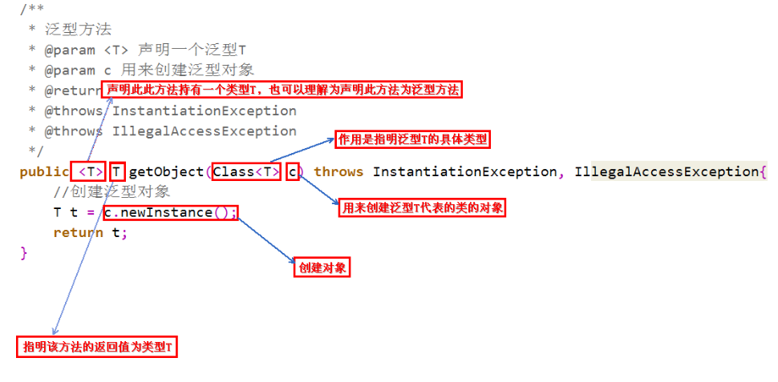

# Effective Java学习笔记（四）：泛型

## 泛型：



## 1、请不要使用原生态类型

1. Set<Object> 是一个参数化类型，表示可以包含任何对象类型的一个集合。**安全**

2. Set<?>是一个通配符类型，表示只能包含某种未知对象类型的一个集合。**安全**

3. Set是一个原生态类型，它脱离了泛型系统。**不安全**

   不安全举例：

   ```java
   public static void main(String[] args) {
           List<String> strings = new ArrayList<>();
           List<Object> objects = new ArrayList<>();
           List<?> object2s = new ArrayList<>();
           unsafeAdd(strings, Integer.valueOf(42));
           String s = strings.get(0); // 执行时会报错。不能在编译时检查出错误。
           objects.add(Integer.valueOf(1));
           objects.add("String");
           objects.add(strings.get(0));
           Raw a = new Raw();
           a.testList(objects);
           a.testList(strings);
       }
   
       public void testList(List<?> objects) {
           System.out.println(objects.get(0));
       }
   
       private static void unsafeAdd(List list, Object o) {
           list.add(o);
       }
   }
   ```

   

## 2、消除非受检警告

## 3、列表优于数组

数组是协变的。Sub为Super的子类型。那么数组类型Sub[]就是Super[]的子类型。

泛型是不可变的。List<Sub>既不是List<Super>的子类型。List<Super>也不是List<Sub>的超类型。

```java
   Object[] objectArray=new Long[1];
   objectArray[0]="我不是数字";//这段代码，编译时不会报错，但是运行时会报错。
   List<Object> objectList=new ArrayList<Long>(); // 编译时会报错。
   objectList.add(111l);
```

## 4、优先考虑泛型

## 5、优先考虑泛型方法

## 6、利用有限制通配符来提升API的灵活性

PECS（Producer Extends Consumer Super）原则，已经很好理解了：

1. 频繁往外读取内容的，适合用上界Extends。
2. 经常往里插入的，适合用下界Super。

补充：泛型中 extends 和 super 的区别？

```java
<? extends T>`：是上界通配符。上界<? extends T>不能往里存，只能往外取

Plate<? extends Fruit>

一个能放水果以及一切是水果派生类的盘子。 Plate<？ extends Fruit>和Plate<Apple>最大的区别就是：Plate<？ extends Fruit>是Plate<Fruit>以及Plate<Apple>`的基类。直接的好处就是，我们可以用“苹果盘子”给“水果盘子”赋值了。
    
<? super T>是下界通配符 。不影响往里存，但往外取只能放在Object对象里
Plate<? super Fruit>
表达的就是相反的概念：一个能放水果以及一切是水果基类的盘子。Plate<？ super Fruit>是Plate<Fruit>的基类，但不是Plate<Apple>的基类。
```


## 7、谨慎并用泛型和可变参数

编译不会报错，执行报错：

```java
public class PickTwo {
    // 这是一个危险的方法，编译时不会报错。但是执行时会导致异常。
    static <T> T[] toArray(T... args) {
        return args;
    }
    //这里会产生一个隐藏的String[] 转换。但是会转换失败。
    static <T> T[] pickTwo(T a, T b, T c) {
        switch(ThreadLocalRandom.current().nextInt(3)) {
            case 0: return toArray(a, b); //在执行过程中，这里返回的是一个Object[] 数组
            case 1: return toArray(a, c);
            case 2: return toArray(b, c);
        }
        throw new AssertionError(); // Can't get here
    }

    public static void main(String[] args) {
         /**
         * Exception in thread "main" java.lang.ClassCastException: class
         * [Ljava.lang.Object; cannot be cast to class [Ljava.lang.String; 
         * ([Ljava.lang.Object; and [Ljava.lang.String; are in module java.base of loader 'bootstrap')
         * 	at effectivejava.chapter5.item32.PickTwo.main(PickTwo.java:27)
         */
        String[] attributes = pickTwo("Good", "Fast", "Cheap");
        System.out.println(Arrays.toString(attributes));
    }
}
```

编译和执行都没有问题：

```java
public class SafePickTwo {
    static <T> List<T> pickTwo(T a, T b, T c) {
        switch(ThreadLocalRandom.current().nextInt(3)) {
            case 0: return List.of(a, b);
            case 1: return List.of(a, c);
            case 2: return List.of(b, c);
        }
        throw new AssertionError();
    }

    public static void main(String[] args) {
        List<String> attributes = pickTwo("Good", "Fast", "Cheap");
        System.out.println(attributes);
    }
}
```


## 8、优先考虑类型安全的异构容器

举例：

```java
public class Favorites {
    private Map<Class<?>, Object> favorites = new HashMap<>();

    public <T> void putFavorite(Class<T> type, T instance) {
        favorites.put(Objects.requireNonNull(type), instance);
    }

    public <T> T getFavorite(Class<T> type) {
        return type.cast(favorites.get(type));
    }

//    // Achieving runtime type safety with a dynamic cast
//    public <T> void putFavorite(Class<T> type, T instance) {
//        favorites.put(Objects.requireNonNull(type), type.cast(instance));
//    }

    public static void main(String[] args) {
        Favorites f = new Favorites();
        f.putFavorite(String.class, "Java");
        f.putFavorite(Integer.class, 0xcafebabe);
        f.putFavorite(Class.class, Favorites.class);
        String favoriteString = f.getFavorite(String.class);
        int favoriteInteger = f.getFavorite(Integer.class);
        Class<?> favoriteClass = f.getFavorite(Class.class);
        System.out.printf("%s %x %s%n", favoriteString,
                favoriteInteger, favoriteClass.getName());
    }
}
```

