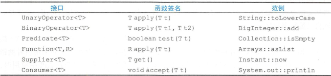

# Effective Java学习笔记（六）：Lambda和Stream

## 1、Lambda优于匿名类

Lambda中的this指的是外围。

匿名类中的this指的是自己。

举例：

```java
public enum Operation {
    PLUS  ("+", (x, y) -> x + y),
    MINUS ("-", (x, y) -> x - y),
    TIMES ("*", (x, y) -> x * y),
    DIVIDE("/", (x, y) -> x / y);

    private final String symbol;
    private final DoubleBinaryOperator op;

    Operation(String symbol, DoubleBinaryOperator op) {
        this.symbol = symbol;
        this.op = op;
    }

    @Override public String toString() { return symbol; }

    public double apply(double x, double y) {
        return op.applyAsDouble(x, y);
    }
}
```

## 2、方法引用优先于Lambda

补充方法引用知识：

```java
/**
 * 英文：double colon，双冒号（::）运算符在Java 8中被用作方法引用（method reference），
 * 方法引用是与lambda表达式相关的一个重要特性。它提供了一种不执行方法的方法。
 * 为此，方法引用需要由兼容的函数接口组成的目标类型上下文。
 * <p>
 * 通过 `::` 关键字来访问类的构造方法，对象方法，静态方法。总结：我们可以把类Keyword中的方法static String
 * startsWith(String s){...}、String endWith(String s){...}、Something(String something){...}
 * 看作是接口IConvert的实现，因为它们都符合接口定义的那个“模版”，
 * 有传参类型F以及返回值类型T。比如构造方法endWith(String something)，它传参为String类型，返回值类型为Something。
 * 注解@FunctionalInterface保证了接口有且仅有一个抽象方法，所以JDK能准确地匹配到相应方法。
 *
 * 以下是Java 8中方法引用的一些语法：
 *
 * 静态方法引用（static method）语法：classname::methodname 例如：Person::getAge
 * 对象的实例方法引用语法：instancename::methodname 例如：System.out::println
 * 对象的超类方法引用语法： super::methodname
 * 类构造器引用语法： classname::new 例如：ArrayList::new
 * 数组构造器引用语法： typename[]::new 例如： String[]:new
 *
 */
public class KeywordTest extends FatherKeyWord {
    @Test
    public void startsWith() {
        //::静态方法引用
        IConvert<String, String> conver = Keyword::startsWith;
        String start = conver.conver("KeywordTest");
        assertEquals("K", start);
    }

    @Test
    public void endWith() {
        //::对象的实例方法引用语法
        IConvert<String, String> conver = new Keyword()::endWith;
        String start = conver.conver("KeywordTest");
        assertEquals("t", start);
    }

    @Test
    public void keyword() {
        //::类构造器引用语法
        IConvert<String, Keyword> conver = Keyword::new;
        Keyword keyword = conver.conver("访问构造方法");
        assertEquals("t", keyword.endWith("KeywordTest"));
    }

    @Test
    public void keywordArray() {
        //::数组构造器引用语法
        IConvert<Integer, Keyword[]> conver = Keyword[]::new;
        Keyword[] array = conver.conver(4);
        assertEquals(4, array.length);
    }

    @Test
    public void keywordSuper() {
        //:: 对象的超类方法引用语法
        IConvert<String, Integer> conver = super::countLength;
        int start = conver.conver("KeywordTest");
        assertEquals(11, start);

    }

    @Test
    public void keywordlambdas() {
        //:: lambdas中的应用
        Optional<String> word = Optional.of("KeywordTest");
        assertEquals("K", word.map(Keyword::startsWith).get());
        assertEquals("t", word.map(new Keyword()::endWith).get());
        Optional<Keyword> words = Optional.of(new Keyword());
        assertEquals("d", words.map(Keyword::endWith)
                .orElse(""));

    }


}
```

## 3、坚持使用标准的函数接口

记住这几个基本函数接口：



如果自定义函数，务必使用@FunctionalInterface注解。

@FunctionalInterface标记在接口上，“函数式接口”是指仅仅只包含一个抽象方法的接口。

## 4、谨慎使用Stream

如果不知道选择迭代方式好？还是Stream方式好。可以两种方式都试试。自己更喜欢哪一种呢？如下：

```java
public class Card {
    public enum Suit { SPADE, HEART, DIAMOND, CLUB }
    public enum Rank { ACE, DEUCE, THREE, FOUR, FIVE, SIX, SEVEN,
                       EIGHT, NINE, TEN, JACK, QUEEN, KING }

    private final Suit suit;
    private final Rank rank;

    @Override public String toString() {
        return rank + " of " + suit + "S";
    }

    public Card(Suit suit, Rank rank) {
        this.suit = suit;
        this.rank = rank;

    }
    private static final List<Card> NEW_DECK = newDeckForStream();

    //基于迭代器实现
    private static List<Card> newDeck() {
        List<Card> result = new ArrayList<>();
        for (Suit suit : Suit.values())
            for (Rank rank : Rank.values())
                result.add(new Card(suit, rank));
        return result;
    }

    // 基于Stream实现
    private static List<Card> newDeckForStream() {
        return Stream.of(Suit.values())
                .flatMap(suit ->
                        Stream.of(Rank.values())
                                .map(rank -> new Card(suit, rank)))
                .collect(Collectors.toList());
    }

    public static void main(String[] args) {
        System.out.println(NEW_DECK);
    }
}
```

## 5、优先选择Stream中无副作用的函数

```java
public class Freq {
    public static void main(String[] args) throws FileNotFoundException {
        File file = new File(args[0]);

        /**
         * 不要这样做，因为forEach的主要目的报告Stream的计算结构，而不是用于计算。
         */
        Map<String, Long> freq_DonotDoThis = new HashMap<>();
        try (Stream<String> words = new Scanner(file).tokens()) {
            words.forEach(word -> {
                freq_DonotDoThis.merge(word.toLowerCase(), 1L, Long::sum);
            });
        }
        Map<String, Long> freq;
        try (Stream<String> words = new Scanner(file).tokens()) {
            freq = words
                    .collect(groupingBy(String::toLowerCase, counting()));
        }

        System.out.println(freq);
        List<String> topTen = freq.keySet().stream()
                //推荐静态引入：import static java.util.Comparator.comparing;
                .sorted(comparing(freq::get).reversed())  //reversed 逆排序
                .limit(10)
                //推荐静态引入import static java.util.stream.Collectors.*;
                .collect(toList());

        System.out.println(topTen);
    }
}
```

补充：

### Collectors 的作用

java.util.stream.Collectors 会根据不同的策略将元素收集归纳起来，比如最简单常用的是将元素装入Map、Set、List 等可变容器中。特别对于 Java 8 Stream Api 来说非常有用。它提供了collect() 方法来对 Stream 流进行终结操作派生出基于各种策略的结果集。


**类型归纳**

作用是将元素分别归纳进可变容器 List、Map、Set、Collection 或者ConcurrentMap 。

Collectors.toList();

Collectors.toMap();

Collectors.toSet();

Collectors.toCollection();

Collectors.toConcurrentMap();

期中：

使用lambda表达式中Collectors.toMap()方法将一个list转化成一个Map：
例：

Map<Long, VipEntity> vipMap = vipList.stream().collect(Collectors.toMap(VipEntity::getUserId, v -> v, (v1, v2) -> v1));

说明：

.collect(Collectors.toMap(VipEntity::getUserId, v -> v, (v1, v2) -> v1))

第一个参数： VipEntity::getUserId 表示选择 VipEntity 的 getUserId 作为map的key值；

第二个参数： v -> v 表示选择将原来list中的每一个VipEntity对象作为map的key对应的每一个value值；

第三个参数：(v1, v2) -> v1 这一行去掉的话，一般情况下也是可以正常执行的；但是，偶然情况下，vipList中
的VipEntity对象是有可能存在重复的，而我们是取VipEntity中的UserId作为Map的key值，众所周知，Map的key是不能相同的，所以此时两个相同的UserId都要作为map的key值，如果不做处理就会直接报异常；而我们**(v1, v2) -> v1**的意思呐就是：当map的key出现重复的时候，我们取第一个key和value作为基准，忽略相同的情况。

另外：
1.你也可以这么写：(v1, v2) -> v2，很明显，这样的意思就是：当map的key出现重复的时候，我们取第2个key和value作为基准，忽略相同的情况；

2.map的key你当然也可以使用别的，上面的例子中VipEntity::getUserId是以UserId作为map的key值，你也可以选择VipEntity::getPhoneNum，以PhoneNum作为map的key值，等等。。。

公共代码：

```java
List<String> servers = newArrayList<>(); 
servers.add("Felordcn"); 
servers.add("Tomcat"); 
servers.add("Jetty"); 
servers.add("Undertow");
servers.add("Resin");
```

**joining**

将元素以某种规则连接起来。该方法有三种重载

```java
Collector<CharSequence, ?, String> joining() 
Collector<CharSequence, ?, String> joining(CharSequence delimiter)    
Collector<CharSequence, ?, String> joining(CharSequence delimiter,CharSequence prefix, CharSequence suffix)    

示例：
// 输出 FelordcnTomcatJettyUndertowResin

servers.stream().collect(Collectors.joining());

// 输出 Felordcn,Tomcat,Jetty,Undertow,Resin

servers.stream().collect(Collectors.joining(","));

// 输出 [Felordcn,Tomcat,Jetty,Undertow,Resin]

servers.stream().collect(Collectors.joining(",", "[", "]"));
```

**collectingAndThen**

该方法先执行了一个归纳操作，然后再对归纳的结果进行 Function 函数处理输出一个新的结果。

```java
// 比如我们将servers joining 然后转成大写，结果为： FELORDCN,TOMCAT,JETTY,UNDERTOW,RESIN servers.stream.collect(Collectors.collectingAndThen(Collectors.joining(","), String::toUpperCase));
```


**groupingBy**

groupingByConcurrent用法类似**groupingBy**，提供类似线程安全。

按照条件对元素进行分组，和 SQL 中的 group by 用法有异曲同工之妙，通常也建议使用 Java 进行分组处理以减轻数据库压力。groupingBy 也有三个重载方法:

```java
public static <T, K> 
    Collector<T, ?, Map<K, List<T>>> 
    groupingBy(Function<? super T, ? extends K> classifier)
public static <T, K, A, D>
    Collector<T, ?, Map<K, D>> 
    groupingBy(Function<? super T, ? extends K> classifier,
                                          Collector<? super T, A, D> downstream) 
public static <T, K, D, A, M extends Map<K, D>>
    Collector<T, ?, M> 
    groupingBy(Function<? super T, ? extends K> classifier,
                                  Supplier<M> mapFactory,
                                  Collector<? super T, A, D> downstream)
示例：
// 按照字符串长度进行分组 符合条件的元素将组成一个 List
//映射到以条件长度为key 的 Map<Integer, List<String>> 中
    servers.stream.collect(Collectors.groupingBy(String::length))
    
//Map<Integer, Set<String>>
servers.stream.collect(Collectors.groupingBy(String::length, Collectors.toSet()))
    
Supplier<Map<Integer,Set<String>>> mapSupplier = HashMap::new;
Map<Integer,Set<String>> collect = servers.stream.collect(Collectors.groupingBy(String::length, mapSupplier, Collectors.toSet()));  
Supplier<Map<Integer, Set<String>>> mapSupplier = 
    () -> Collections.synchronizedMap(new HashMap<>());
Map<Integer, Set<String>> collect = servers.stream.collect(Collectors.groupingBy(String::length, mapSupplier, Collectors.toSet()));
```


**partitioningBy**

partitioningBy()方法是java.util.stream.Collectors类的预定义方法，该类用于根据给定谓词对对象(或元素集)流进行分区。存在两种方法的重载变体。一个仅将谓词作为参数，而另一个将谓词和Collector实例作为参数。

partitioningBy(Predicate<? super T> predicate)

**用法:**

public static <T> Collector<T, ?, Map<Boolean, List<T>>> partitioningBy(Predicate<? super T> predicate)

其中:

- 接口Collector<T，A，R>

  ：一种可变的归约运算，它将输入元素累积到一个可变结果容器中，在处理完所有输入元素之后，可以有选择地将累积的结果转换为最终表示形式。还原操作可以顺序或并行执行。

  - **T:**归约运算的输入元素的类型。
  - **A:**归约运算的可变累积类型。
  - **R:**归约运算的结果类型。

- **Map <布尔值，列表<T >>：**包含输出的映射。键是布尔值(true或false)，相应的值是包含T类型元素的列表。

**参数：**此方法采用强制性参数谓词，该谓词是类型T的谓词接口的实例。

**返回值：**此方法返回实现分区操作的Collector。

下面是一个示例来说明partitioningBy()方法：

**程序：**

```java
class Gfg { 
    public static void main(String[] args) 
    { 
        Stream<Integer> 
            s = Stream.of(1, 2, 3, 4, 5, 6, 7, 8, 9, 10); 
  
        // using Collectors partitioningBy() 
        // method to split the stream of elements into 
        // 2 parts, greater than 3 and less than 3. 
        Map<Boolean, List<Integer> > 
            map = s.collect( 
                Collectors.partitioningBy(num -> num > 3)); 
  
        // Displaying the result as a map 
        // true if greater than 3, false otherwise 
        System.out.println("Elements in stream "
                           + "partitioned by "
                           + "less than equal to 3:\n"
                           + map); 
    } 
}
输出：
Elements in stream partitioned by less than equal to 3:
{false=[1, 2, 3], true=[4, 5, 6, 7, 8, 9, 10]}
```

partitioningBy(Predicate<? super T>predicate, Collector<? super T, A, D> downstream)

**用法:**

public static <T> Collector<T, ?, Map<Boolean, List<T>>> partitioningBy(Predicate<? super T>predicate, Collector<? super T, A, D> downstream)

其中:

- 接口Collector<T，A，R>

  ：一种可变的归约运算，它将输入元素累积到一个可变结果容器中，在处理完所有输入元素之后，可以有选择地将累积的结果转换为最终表示形式。还原操作可以顺序或并行执行。

  - **T:**归约运算的输入元素的类型。
  - **A:**归约运算的可变累积类型。
  - **R:**归约运算的结果类型。

- **Map <布尔值，列表<T >>：**包含输出的映射。键是布尔值(true或false)，相应的值是包含T类型元素的列表。

**参数：**此方法采用两个参数：一个谓词(一个T类型的谓词接口的实例)和一个用于实现“downstream reduction”并产生输出的Collector。

**返回值：**此方法返回实现分区操作的Collector。

下面是一个示例，说明partitioningBy()方法的类型2：

```java
 
class ArraytoArrayList { 
  
    // Driver code 
    public static void main(String[] args) 
    { 
        // creating an Integer stream 
        Stream<Integer> 
            s = Stream.of(1, 2, 3, 4, 5, 6, 7, 8, 9, 10); 
  
        // Using Collectors.counting() method 
        // to count the number of elements in 
        // the 2 partitions 
        Map<Boolean, Long> 
            map = s.collect( 
                Collectors.partitioningBy( 
                    num -> (num > 3), Collectors.counting())); 
  
        // Displaying the result as a map 
        // true if greater than 3, false otherwise 
        System.out.println("Elements in stream "
                           + "partitioned by "
                           + "less than equal to 3:\n"
                           + map); 
    } 
}
输出：
Elements in stream partitioned by less than equal to 3:
{false=3, true=7}
```

**counting**

```java
int count = listUser.stream().collect(Collectors.counting());  // count其实就等于listUser.size();
```


**maxBy/minBy**

这两个方法分别提供了查找大小元素的操作，它们基于比较器接口 Comparator 来比较 ，返回的是一个 Optional 对象。 我们来获取 servers 中最小长度的元素:

```java
Optional<String> min = servers.stream.collect(Collectors.minBy(Comparator.comparingInt(String::length)));
```


**summingInt/Double/Long**

用来做累加计算。计算元素某个属性的总和,类似 Mysql 的 sum 函数，比如计算各个项目的盈利总和、计算本月的全部工资总和等等。我们这里就计算一下 servers 中字符串的长度之和 （为了举例不考虑其它写法）。

```java
// 总长度 
servers.stream.collect(Collectors.summingInt(s -> s.length()));
```


**summarizingInt/Double/Long**
这三个方法通过对元素某个属性的提取，会返回对元素该属性的统计数据对象，分别对应 `IntSummaryStatistics`、`DoubleSummaryStatistics`、`LongSummaryStatistics`。我们对 `servers` 中元素的长度进行统计：

```java
DoubleSummaryStatistics doubleSummaryStatistics = servers.stream.collect(Collectors.summarizingDouble(String::length));
// {count=5, sum=32.000000, min=5.000000, average=6.400000,max=8.000000}
System.out.println("doubleSummaryStatistics.toString() = "+ doubleSummaryStatistics.toString());
结果DoubleSummaryStatistics中包含了 **总数，总和，最小值，最大值，平均值** 五个指标。
```

**mapping**

该方法是先对元素使用 Function 进行再加工操作，然后用另一个Collector 归纳。比如我们先去掉 servers 中元素的首字母，然后将它们装入 List 。

```java
// [elordcn, omcat, etty, ndertow, esin]
servers.stream.collect(Collectors.mapping(s -> s.substring(1), Collectors.toList()));
servers.stream.map(s -> s.substring(1)).collect(Collectors.toList());
```

 **reducing**

这个方法非常有用！但是如果要了解这个就必须了解其参数 BinaryOperator<T> 。 这是一个函数式接口，是给两个相同类型的量，返回一个跟这两个量相同类型的一个结果，伪表达式为 (T,T) -> T。默认给了两个实现 maxBy 和 minBy ，根据比较器来比较大小并分别返回最大值或者最小值。当然你可以灵活定制。然后 reducing 就很好理解了，元素两两之间进行比较根据策略淘汰一个，随着轮次的进行元素个数就是 reduce 的。那这个有什么用处呢？ Java 官方给了一个例子：统计每个城市个子最高的人。

```java
Comparator<Person> byHeight = Comparator.comparing(Person::getHeight);
Map<String, Optional<Person>> tallestByCity = people.stream().collect(Collectors.groupingBy(Person::getCity, Collectors.reducing(BinaryOperator.maxBy(byHeight))));
```

结合最开始给的例子你可以使用 reducing 找出最长的字符串试试。

上面这一层是根据 Height 属性找最高的 Person ，而且如果这个属性没有初始化值或者没有数据，很有可能拿不到结果所以给出的是 Optional<Person>。 如果我们给出了 identity 作一个基准值，那么我们首先会跟这个基准值进行 BinaryOperator 操作。
比如我们给出高于 2 米 的人作为 identity。 我们就可以统计每个城市不低于 2 米 而且最高的那个人，当然如果该城市没有人高于 2 米则返回基准值identity ：

```java
Comparator<Person> byHeight = Comparator.comparing(Person::getHeight);
Person identity= new Person();identity.setHeight(2);
identity.setName("identity");
Map<String, Person> collect = persons.stream().collect(Collectors.groupingBy(Person::getCity, Collectors.reducing(identity, BinaryOperator.maxBy(byHeight))));
```

这时候就确定一定会返回一个 Person 了，最起码会是基准值identity 不再是 Optional 。

还有些情况，我们想在 reducing 的时候把 Person 的身高先四舍五入一下。这就需要我们做一个映射处理。定义一个 Function<? super T, ? extends U> mapper 来干这个活。那么上面的逻辑就可以变更为：

```java
Comparator<Person> byHeight = Comparator.comparing(Person::getHeight);
Person identity = new Person();
identity.setHeight(2);
identity.setName("identity");
// 定义映射 处理 四舍五入
Function<Person, Person> mapper = ps -> {Double height = ps.getHeight();
                                         BigDecimal decimal = new BigDecimal(height);
                                         Double d = decimal.setScale(1,BigDecimal.ROUND_HALF_UP).doubleValue();
                                         ps.setHeight(d);
                                         return ps;};
Map<String, Person> collect = persons.stream().collect(Collectors.groupingBy(Person::getCity, Collectors.reducing(identity, mapper, BinaryOperator.maxBy(byHeight))));
```

## 6、Stream要优先于Collection作为返回类型

一个非常好的适配。Stream<E> to Iterable<E>    和   Iterable<E> to Stream<E>

```java
public class Adapters {
    // Adapter from  Stream<E> to Iterable<E> (
    public static <E> Iterable<E> iterableOf(Stream<E> stream) {
        return stream::iterator;
    }

    // Adapter from Iterable<E> to Stream<E>
    public static <E> Stream<E> streamOf(Iterable<E> iterable) {
        return StreamSupport.stream(iterable.spliterator(), false);
    }
}
```


## 7、谨慎使用Stream并行

parallel()执行未提示异常，但是stream并不知道如何优化并行计算，如下所示：

```java
public class ParallelMersennePrimes {
    public static void main(String[] args) {
        primes().map(p -> TWO.pow(p.intValueExact()).subtract(ONE))
                //这个地方在程序执行时，会导致意想不到的问题。例如CPU跑满，但是程序一直没有输出
                .parallel()
                .filter(mersenne -> mersenne.isProbablePrime(50))
                .limit(20)
                .forEach(System.out::println);
    }

    static Stream<BigInteger> primes() {
        return Stream.iterate(TWO, BigInteger::nextProbablePrime);
    }
}

```

这个示例可以很好地应用，并行计算

```java
public class ParallelPrimeCounting {
    // Prime-counting stream pipeline - parallel version (Page 225)
    static long pi(long n) {
        return LongStream.rangeClosed(2, n)
                .parallel()
                .mapToObj(BigInteger::valueOf)
                .filter(i -> i.isProbablePrime(50))
                .count();
    }

    public static void main(String[] args) {
        System.out.println(pi(10_000_000));
    }
}
```


