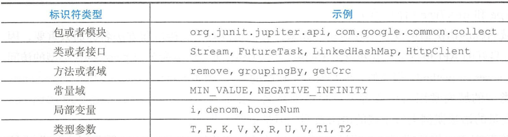

## Effective Java学习笔记（八）：通用编程

## 1、将局部变量的作用域最小化

要使局部变量的作用域最小化，最有力的方法就是在第一次要使用它的地方进行声名。

## 2、for-each循环优先于传统的for循环

参考：

```java
public class DiceRolls {
    enum Face { ONE, TWO, THREE, FOUR, FIVE, SIX }

    public static void main(String[] args) {
        // Same bug, different symptom!
        Collection<Face> faces = EnumSet.allOf(Face.class);

        for (Iterator<Face> i = faces.iterator(); i.hasNext(); )
            for (Iterator<Face> j = faces.iterator(); j.hasNext(); )
                //这里面有个BUG。多次调用了i.next
                System.out.println(i.next() + " " + j.next());

        System.out.println("***************************");

        for (Face f1 : faces)
            for (Face f2 : faces)
                System.out.println(f1 + " " + f2);
    }
}

```

有三种常见情况无法使用for-each循环：

1. 解构过滤：如果需要遍历集合，并删除选定的元素，就需要使用显式的迭代器。可以考虑使用Collection中加入了removeIf方法,如： employeeList.removeIf((Employee emp) -> emp.getAge() >= 30);
2. 转换：如果需要遍历结合，并取代它的部分或者全部元素值。
3. 平行迭代：并行地遍历集合。

## 3、了解和使用类库

随机数：JDK7以后使用：

```java
ThreadLocalRandom t=ThreadLocalRandom.current();
System.out.println(t.nextInt(50));//随机生成0~50的随机数，不包括50
System.out.println(t.nextInt(30, 50));//随机生成30~50的随机数，不包括50
```

补充知识：随机数

```java
java.util.Random：JDK7以后推荐使用ThreadLocalRandom
java.util.concurrent.ThreadLocalRandom
java.security.SecureRandom：默认支持两种RNG加密算法实现：
    1、”SHA1PRNG”算法提供者sun.security.provider.SecureRandom
    2、 ”NativePRNG”提供者sun.security.provider.NativePRNG
    默认情况下，是“SHA1PRNG”，即SUN提供的实现。此外可以通过
    “-Djava.security=file:/dev/urandom”
    （推荐）或者
    “-Djava.security=file:/dev/random”
    指定使用linux本地的随机算法，
    即NativePRNG；其中“/dev/random”与“/dev/urandom”在不同unix-*平台中实现有所不同，性能也有所差异，建议使用“/dev/urandom”。/dev/random的一个副本是/dev/urandom （”unlocked”，非阻塞的随机数发生器），它会重复使用熵池中的数据以产生伪随机数据。这表示对/dev/urandom的读取操作不会产生阻塞，但其输出的熵可能小于/dev/random的。它可以作为生成较低强度密码的伪随机数生成器，不建议用于生成高强度长期密码。

java.util.SplittableRandom：
     JDK 8 新增的API，主要适用于Fork/join形式的跨线程操作中。它并没有继承java.util.Random类。具有相同seed的不同SplittableRandom实例或者同一个SplittableRandom，多次运行结果是一致的。这和Random是一致的。非线程安全，不能被并发使用。 （不会报错，但是并发时可能多个线程同时得到相同的随机数）

```

至少应该熟悉以下类库：

java.lang、java.util、java.io

## 4、如果需要精确的答案，请避免使用float和double

尤其不适合货币计算。

适合货币计算的一种方式：

```java
//这种方式速度慢，使用也不方便。但是千万不能使用float和double
public class BigDecimalChange {
    public static void main(String[] args) {
        //不要使用double构造器，避免不正确的值引入
        final BigDecimal TEN_CENTS = new BigDecimal(".10");

        int itemsBought = 0;
        BigDecimal funds = new BigDecimal("1.00");
        for (BigDecimal price = TEN_CENTS;
             funds.compareTo(price) >= 0;
             price = price.add(TEN_CENTS)) {
            funds = funds.subtract(price);
            itemsBought++;
        }
        System.out.println(itemsBought + " items bought.");
        System.out.println("Money left over: $" + funds);
    }
}
//改为使用long或者int类型,自己处理小数。
//不超过9位可以考虑使用int
//不超过18位可以考虑使用long
//超过18位，选择BigDecimal
public class IntChange {
    public static void main(String[] args) {
        int itemsBought = 0;
        int funds = 100;
        for (int price = 10; funds >= price; price += 10) {
            funds -= price;
            itemsBought++;
        }
        System.out.println(itemsBought + " items bought.");
        System.out.println("Cash left over: " + funds + " cents");
    }
}
```

## 5、基本类型优先于装箱基本类型

装箱类型用在集合中的元素，键和值。

参数化类型和方法时，必须使用装箱类型。

在进行反射的方法调用时，必须使用装箱类型。

错误使用的例子：

```java
public class BrokenComparator {
    public static void main(String[] args) {

        Comparator<Integer> naturalOrder =
                (i, j) -> (i < j) ? -1 : (i == j ? 0 : 1);

       // 修正的方法
//        Comparator<Integer> naturalOrder = (iBoxed, jBoxed) -> {
//            int i = iBoxed, j = jBoxed; // Auto-unboxing
//            return i < j ? -1 : (i == j ? 0 : 1);
//        };

        int result = naturalOrder.compare(new Integer(42), new Integer(42));
        System.out.println(result);
    }
}
```

## 6、如果其他类型更适合，则尽量避免使用字符串

字符串不适合代替其他的值类型

字符串不适合代替枚举类型

字符串不适合代替聚合类型

字符串也不适合代替能力表

## 7、了解字符串连接的性能

使用StringBuilder代替String的"+"

## 8、通过接口引用对象

## 9、接口优先于反射机制

## 10、谨慎的使用本地方法

使用本地方法来提高性能的做法不值得提倡。

## 11、谨慎地进行优化

1. 要努力编写好的程序而不是快的程序

2. 要努力避免那些限制性能的设计决策

3. 要考虑API设计决策的性能后果

4. 了解一下工具jmh：JMH即Java Microbenchmark Harness，是Java用来做基准测试的一个工具，该工具由OpenJDK提供并维护，测试结果可信度高。


知识补充：

```java
/**
 * 使用JMH做Benchmark基准测试
 * 注解介绍
 *
 * @BenchmarkMode Mode 表示 JMH 进行 Benchmark 时所使用的模式。通常是测量的维度不同，或是测量的方式不同。目前 JMH 共有四种模式：
 * <p>
 * Throughput: 整体吞吐量，例如“1秒内可以执行多少次调用”，单位是操作数/时间。
 * AverageTime: 调用的平均时间，例如“每次调用平均耗时xxx毫秒”，单位是时间/操作数。
 * SampleTime: 随机取样，最后输出取样结果的分布，例如“99%的调用在xxx毫秒以内，99.99%的调用在xxx毫秒以内”
 * SingleShotTime: 以上模式都是默认一次 iteration 是 1s，唯有 SingleShotTime 是只运行一次。
 * 往往同时把 warmup 次数设为0，用于测试冷启动时的性能。
 * @OutputTimeUnit 输出的时间单位。
 * @Iteration Iteration 是 JMH 进行测试的最小单位。在大部分模式下，一次 iteration 代表的是一秒，
 * JMH 会在这一秒内不断调用需要 Benchmark 的方法，
 * 然后根据模式对其采样，计算吞吐量，计算平均执行时间等。
 * @WarmUp Warmup 是指在实际进行 Benchmark 前先进行预热的行为。
 * <p>
 * 为什么需要预热？因为 JVM 的 JIT 机制的存在，如果某个函数被调用多次之后，
 * JVM 会尝试将其编译成为机器码从而提高执行速度。
 * 为了让 Benchmark 的结果更加接近真实情况就需要进行预热。
 * @State 类注解，JMH测试类必须使用 @State 注解，它定义了一个类实例的生命周期，可以类比 Spring Bean 的 Scope。
 * 由于 JMH 允许多线程同时执行测试，不同的选项含义如下：
 * <p>
 * Scope.Thread：默认的 State，每个测试线程分配一个实例；
 * Scope.Benchmark：所有测试线程共享一个实例，用于测试有状态实例在多线程共享下的性能；
 * Scope.Group：每个线程组共享一个实例；
 * @Fork 进行 fork 的次数。如果 fork 数是2的话，则 JMH 会 fork 出两个进程来进行测试。
 * @Meansurement 提供真正的测试阶段参数。指定迭代的次数，每次迭代的运行时间和每次迭代测试调用的数量(
 * 通常使用 @BenchmarkMode(Mode.SingleShotTime) 测试一组操作的开销——而不使用循环)
 * @Setup 方法注解，会在执行 benchmark 之前被执行，正如其名，主要用于初始化。
 * @TearDown 方法注解，与@Setup 相对的，会在所有 benchmark 执行结束以后执行，主要用于资源的回收等。
 * @Setup/@TearDown注解使用Level参数来指定何时调用fixture： 名称    描述
 * Level.Trial	默认level。全部benchmark运行(一组迭代)之前/之后
 * Level.Iteration	一次迭代之前/之后(一组调用)
 * Level.Invocation	每个方法调用之前/之后(不推荐使用，除非你清楚这样做的目的)
 * @Benchmark 方法注解，表示该方法是需要进行 benchmark 的对象。
 * @Param 成员注解，可以用来指定某项参数的多种情况。
 * 特别适合用来测试一个函数在不同的参数输入的情况下的性能。
 * @Param 注解接收一个String数组，在 @Setup 方法执行前转化为为对应的数据类型。
 * 多个 @Param 注解的成员之间是乘积关系，譬如有两个用 @Param 注解的字段，第一个有5个值，第二个字段有2个值，
 * 那么每个测试方法会跑5*2=10次。
 * <p>
 * 查看报告结果：
 * 大多数情况只需要关注最下面的结果。
 * 可以结合 Score 和 Unit 这两列，看到方法的效率。
 * <p>
 * @ClassName JMHFirstBenchmark.java
 * @Description TODO
 * @createTime 2021年10月12日 10:43:00
 */
@BenchmarkMode(Mode.AverageTime) // 调用的平均时间，例如“每次调用平均耗时xxx毫秒”。
@OutputTimeUnit(TimeUnit.MILLISECONDS) // 结果所使用的时间单位
@State(Scope.Thread) // 每个测试线程分配一个实例
@Fork(2) // Fork进行的数目
@Warmup(iterations = 2) // 先预热4轮
@Measurement(iterations = 2) // 进行10轮测试
public class JMHFirstBenchmark {

    public static void main(String[] args) throws RunnerException {
        Options opt = new OptionsBuilder()
                //benchmark 所在的类的名字，注意这里是使用正则表达式对所有类进行匹配的。
                .include(".*JMHFirstBenchmark.*")
                //进行 fork 的次数。如果 fork 数是2的话，则 JMH 会 fork 出两个进程来进行测试。
                // .forks(2)
                //预热的迭代次数。
                // .warmupIterations(2)
                //实际测量的迭代次数。
                // .measurementIterations(2)
                .build();

        new Runner(opt).run();
    }

    @Param({"11", "22"}) // 定义四个参数，之后会分别对这四个参数进行测试
    private int n;

    private List<Integer> arrayListOfNumbers;
    private List<Integer> linkedListOfNumbers;

    @Setup(Level.Trial) // 初始化方法，在全部Benchmark运行之前进行
    public void init() {
        arrayListOfNumbers = new ArrayList<>();
        addNumbers(arrayListOfNumbers);

        linkedListOfNumbers = new LinkedList<>();
        addNumbers(linkedListOfNumbers);
    }

    private void addNumbers(List<Integer> container) {
        IntStream.range(0, 1_000_000)
                .forEach(container::add);
    }

    @Benchmark
    public int slowSumOfSquares() {
        return linkedListOfNumbers.parallelStream()
                .map(x -> x * x)
                .reduce(0, (acc, x) -> acc + x);
    }

    @Benchmark
    public int serialSlowSumOfSquares() {
        return linkedListOfNumbers.stream()
                .map(x -> x * x)
                .reduce(0, (acc, x) -> acc + x);
    }

    @Benchmark
    public int intermediateSumOfSquares() {
        return arrayListOfNumbers.parallelStream()
                .map(x -> x * x)
                .reduce(0, (acc, x) -> acc + x);
    }

    @Benchmark
    public int serialIntermediateSumOfSquares() {
        return arrayListOfNumbers.stream()
                .map(x -> x * x)
                .reduce(0, (acc, x) -> acc + x);
    }

    @Benchmark
    public int fastSumOfSquares() {
        return arrayListOfNumbers.parallelStream()
                .mapToInt(x -> x * x)
                .sum();
    }

    @Benchmark
    public int serialFastSumOfSquares() {
        return arrayListOfNumbers.stream()
                .mapToInt(x -> x * x)
                .sum();
    }

    @TearDown(Level.Trial) // 结束方法，在全部Benchmark运行之后进行
    public void arrayRemove() {
        arrayListOfNumbers.clear();
        linkedListOfNumbers.clear();
    }
}
```

## 12、遵守普遍接受的命名惯例

类型参数名称通常由单个字母组成。这个字母通常是以下五种类型之一：T代表任意的类型 ， E表示集合的元素类型  ，  K和V表示映射的键和值的类型 ， X表示异常的类型。任何类型的序列可以是T，U，V或者T1，T2，T3。

惯例举例：



