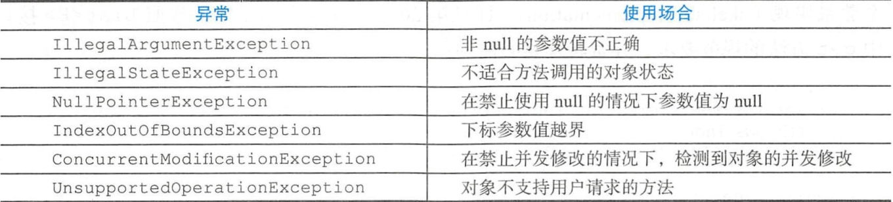

# Effective Java学习笔记（九）：异常

## 1、只针对异常的情况使用异常

## 2、对可恢复的情况使用受检异常，对编程错误使用运行时异常

受检异常

运行时异常

错误

如果期望调用着能够适当地恢复，对于这种情况就应该使用受检异常。

用运行时异常来表明编程错误。

个人实现的所有为受检的抛出结构都应该是RuntimeException的子类

## 3、避免不必要地使用受检异常

## 4、优先使用标准异常

常见的可重用异常：

## 5、抛出与抽象对应的异常

## 6、每个方法抛出的所有异常都要建立文档

## 7、在细节消息中包含失败-捕获信息

## 8、努力使失败保持原子性

## 9、不要忽略异常

