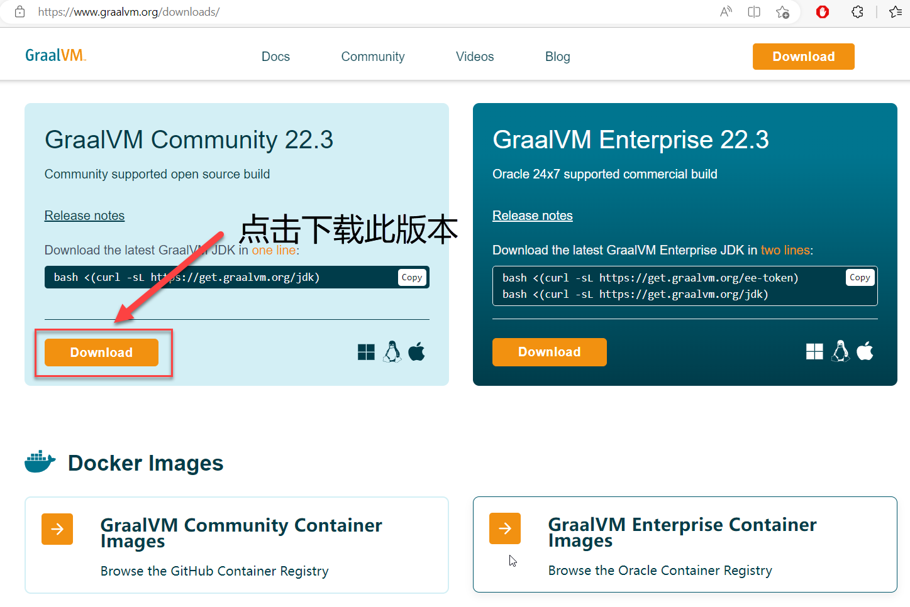
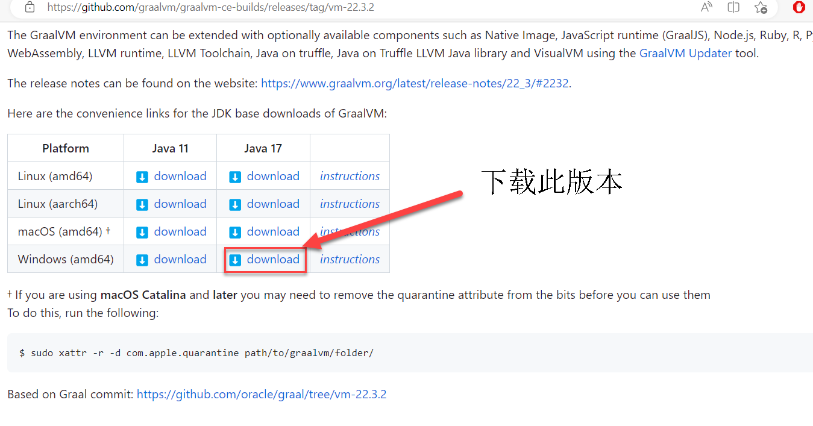
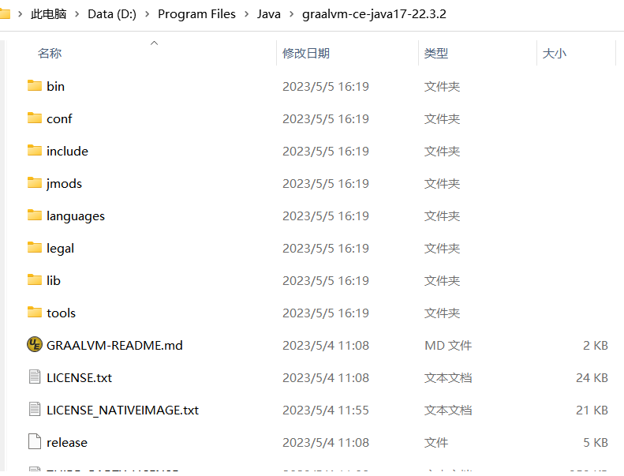
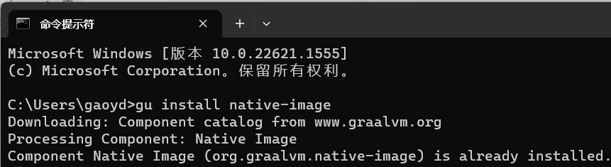
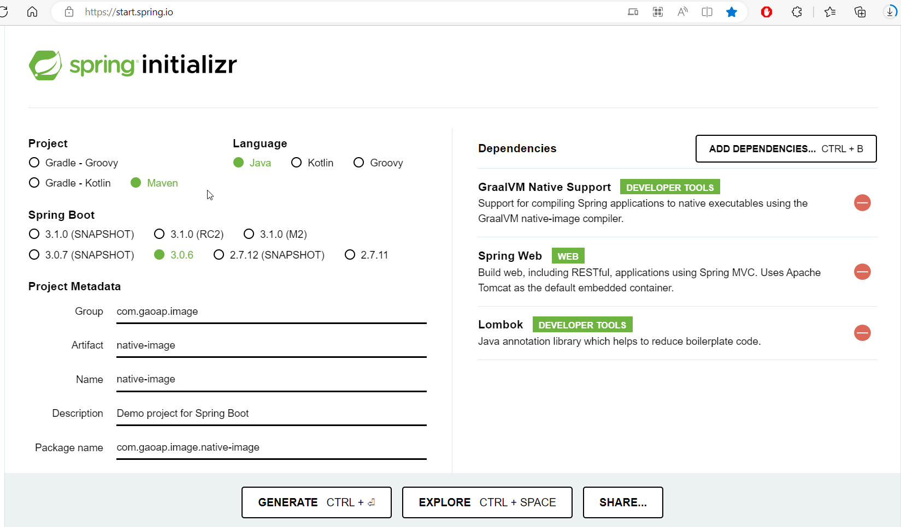
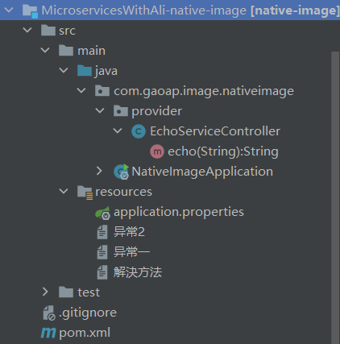
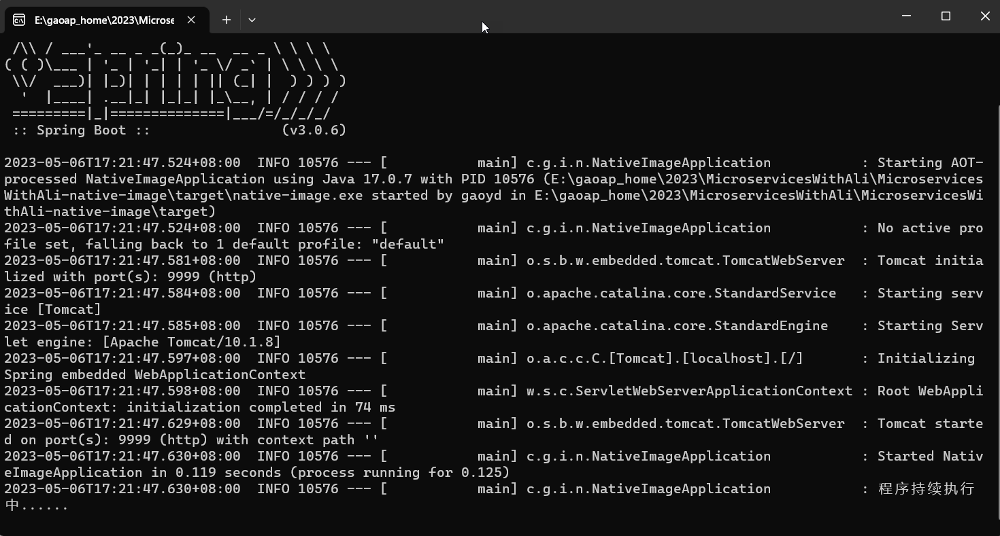
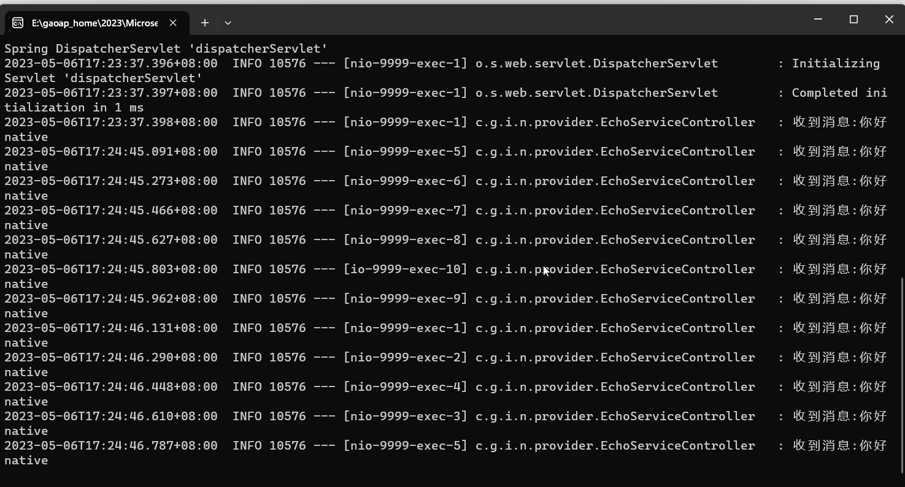

# 在spring boot3中使用**GraalVM Native Support**

## using the GraalVM native-image compiler


1、安装和配置编译环境

1.1、GraalVM下载和安装

进入官网：https://www.graalvm.org/



下载地址是[Release GraalVM Community Edition 22.3.2 · graalvm/graalvm-ce-builds · GitHub](https://github.com/graalvm/graalvm-ce-builds/releases/tag/vm-22.3.2)。如果打不开，多试几次就可以了。



下载的是graalvm-ce-java17-windows-amd64-22.3.2.zip的压缩文件。如解压后目录如下：



解压后配置系统环境变量即可。

如：

```java
GRAALVM_HOME=D:\Program Files\Java\graalvm-ce-java17-22.3.2

JAVA_HOME=D:\Program Files\Java\graalvm-ce-java17-22.3.2

MAVEN_HOME=E:\gaoap_home\tools\apache-maven-3.8.2

CLASSPATH=.;%JAVA_HOME%\lib\dt.jar;%JAVA_HOME%\lib\tools.jar;

PATH=%GRAALVM_HOME%\bin;%JAVA_HOME%\bin;%MAVEN_HOME%\bin
```

备注：一开始使用的apache-maven-3.9.1。但是在IDEA2021.2.3版本中，加载一些依赖时报错。不知道是不是兼容性的问题。所以改为

apache-maven-3.8.2版本使用。IDEA中加载maven依赖未再出现异常。

然后再CMD窗口执行：Java -version 查看是否配置成功。

```c#
`C:\Users\gaoyd>Java -version
java version "17" 2021-09-14 LTS
Java(TM) SE Runtime Environment (build 17+35-LTS-2724)
Java HotSpot(TM) 64-Bit Server VM (build 17+35-LTS-2724, mixed mode, sharing)`
```

在CMD窗口执行：gu install native-image 



命令执行后，需要等待一段时间，不要着急。

1.2、安装Visual Studio 编译为平台码所用

打开Microsoft Store：搜索“visual studio”。选择安装下面的版本“Visual Studio Community 2022”


选择安装组件：


选择好组件后，点击“安装”按钮，根据提示等待安装即可。

安装完成后，在指定的目录下会出现如下的新目录：本地指定的安装目录为D:\下

D:\Program Files\Microsoft Visual Studio\2022

D:\Windows Kits\10

配置环境变量：

```java
MSVC=D:\Program Files\Microsoft Visual Studio\2022\Community\VC\Tools\MSVC\14.35.32215
WK10_INCLUDE=D:\Windows Kits\10\Include\10.0.22000.0
WK10_LIB=D:\Windows Kits\10\Lib\10.0.22000.0
INCLUDE=%MSVC%\include;%WK10_INCLUDE%\ucrt;%WK10_INCLUDE%\shared;%WK10_INCLUDE%\winrt;%WK10_INCLUDE%\um
LIB=%WK10_LIB%\um\x64;%WK10_LIB%\ucrt\x64;%MSVC%\lib\x64

PATH=%MSVC%\bin\Hostx64\x64
```

备注在PATH环境变量中%MSVC%\bin\Hostx64\x64在第一位置。否则会出现找不到cl.exe的错误。如下：

```java
[1/7] Initializing...                                                                                    (0.0s @ 0.27GB)
Error: Default native-compiler executable 'cl.exe' not found via environment variable PATH
Error: To prevent native-toolchain checking provide command-line option -H:-CheckToolchain
Error: Use -H:+ReportExceptionStackTraces to print stacktrace of underlying exception
```


如此基础环境配置完毕。

2、native 工程创建

打开地址：[Spring Initializr](https://start.spring.io/)

选择配置如下：



注意关键点：

SpringBoot选择3.0.6版本

依赖选择：**GraalVM Native Support** 

根据项目需要选择**Spring Web**和**Lombok** 生成项目即可。

2.1POM.XML文件

```xml
<?xml version="1.0" encoding="UTF-8"?>
<project xmlns="http://maven.apache.org/POM/4.0.0" xmlns:xsi="http://www.w3.org/2001/XMLSchema-instance"
         xsi:schemaLocation="http://maven.apache.org/POM/4.0.0 https://maven.apache.org/xsd/maven-4.0.0.xsd">
    <modelVersion>4.0.0</modelVersion>
    <parent>
        <groupId>org.springframework.boot</groupId>
        <artifactId>spring-boot-starter-parent</artifactId>
        <version>3.0.6</version>
        <relativePath/> <!-- lookup parent from repository -->
    </parent>
    <groupId>com.gaoap.image</groupId>
    <artifactId>native-image</artifactId>
    <version>0.0.1-SNAPSHOT</version>
    <name>native-image</name>
    <description>Demo project for Spring Boot</description>
    <properties>
        <java.version>17</java.version>
    </properties>
    <dependencies>
        <dependency>
            <groupId>org.springframework.boot</groupId>
            <artifactId>spring-boot-starter-web</artifactId>
        </dependency>

        <dependency>
            <groupId>org.projectlombok</groupId>
            <artifactId>lombok</artifactId>
            <optional>true</optional>
        </dependency>
        <dependency>
            <groupId>org.springframework.boot</groupId>
            <artifactId>spring-boot-starter-test</artifactId>
            <scope>test</scope>
        </dependency>
    </dependencies>

    <build>
        <plugins>
            <plugin>
                <!-- 实际就是在build的组件中增加了此插件，用于GraalVM Native Support -->
                <groupId>org.graalvm.buildtools</groupId>
                <artifactId>native-maven-plugin</artifactId>
            </plugin>
            <plugin>
                <groupId>org.springframework.boot</groupId>
                <artifactId>spring-boot-maven-plugin</artifactId>
                <configuration>
                    <excludes>
                        <exclude>
                            <groupId>org.projectlombok</groupId>
                            <artifactId>lombok</artifactId>
                        </exclude>
                    </excludes>
                </configuration>
            </plugin>
        </plugins>
    </build>

</project>
```

2.2 java 代码

```java
import lombok.extern.slf4j.Slf4j;
import org.springframework.boot.SpringApplication;
import org.springframework.boot.autoconfigure.SpringBootApplication;

//传统的Spring Boot3单元测试技术仍然可以使用。需要注意的是 Spring Native不支持JUnit4，需要使用JUnit5。
@SpringBootApplication
@Slf4j
public class NativeImageApplication {
    public static void main(String[] args) {
        System.out.println("程序启动了！");
        log.info("程序启动了！.......");
        SpringApplication.run(NativeImageApplication.class, args);
        log.info("程序持续执行中......");
    }
}
```

```java
import lombok.extern.slf4j.Slf4j;
import org.springframework.web.bind.annotation.GetMapping;
import org.springframework.web.bind.annotation.PathVariable;
import org.springframework.web.bind.annotation.RestController;

@RestController
@Slf4j
public class EchoServiceController {
    @GetMapping("/echo/{message}")
    public String echo(@PathVariable String message) {
        log.info("收到消息:{}",message);
        return "[ECHO] : " + message ;
    }
}
```

2.3 application.properties配置端口：

```properties
server.port=9999
```

工程目录如下：



3、工程编译

在工程目录下执行：E:\gaoap_home\2023\MicroservicesWithAli\MicroservicesWithAli-native-image执行如下命令：

```c#
mvn -Pnative native:compile
```

 等待执行完毕，出现如下提示：

```java
E:\gaoap_home\2023\MicroservicesWithAli\MicroservicesWithAli-native-image\target\native-image.exe (executable)
========================================================================================================================

Finished generating 'native-image' in 1m 28s.
[INFO] ------------------------------------------------------------------------
[INFO] BUILD SUCCESS
[INFO] ------------------------------------------------------------------------
[INFO] Total time:  01:42 min
[INFO] Finished at: 2023-05-06T17:09:04+08:00
[INFO] ------------------------------------------------------------------------
PS E:\gaoap_home\2023\MicroservicesWithAli\MicroservicesWithAli-native-image>
```

说明生成native-image.exe 执行文件成功。

3.1、异常情况说明

```Java
Error: Default native-compiler executable 'cl.exe' not found via environment variable PATH
Error: To prevent native-toolchain checking provide command-line option -H:-CheckToolchain
Error: Use -H:+ReportExceptionStackTraces to print stacktrace of underlying exception
```

此异常，多是没有配置正确PATH=%MSVC%\bin\Hostx64\x64 或者%MSVC%\bin\Hostx64\x64 没有配置在PATH中的第一位置。

```java
fatal error C1083: 无法打开包括文件: “stdio.h”: No such file or dir
```

此异常，也是环境变量没有配置正确或者Visual Studio组件不全。再次确认环境变量：

```java
MSVC=D:\Program Files\Microsoft Visual Studio\2022\Community\VC\Tools\MSVC\14.35.32215
WK10_INCLUDE=D:\Windows Kits\10\Include\10.0.22000.0
WK10_LIB=D:\Windows Kits\10\Lib\10.0.22000.0
INCLUDE=%MSVC%\include;%WK10_INCLUDE%\ucrt;%WK10_INCLUDE%\shared;%WK10_INCLUDE%\winrt;%WK10_INCLUDE%\um
LIB=%WK10_LIB%\um\x64;%WK10_LIB%\ucrt\x64;%MSVC%\lib\x64
```

检查上述配置文件，是否配置。并确认相关目录文件是否存在。如果目录不存在，请重新安装Visual Studio。

4、执行程序

打开目录：E:\gaoap_home\2023\MicroservicesWithAli\MicroservicesWithAli-native-image

找到native-image.exe文件，就是编译成的本地执行文件。

双击native-image.exe文件。



程序启动成功，明显启动速度快速很多。

打开浏览器，访问：[localhost:9999/echo/你好native](http://localhost:9999/echo/你好native)


返回成功。

日志正常打印：



