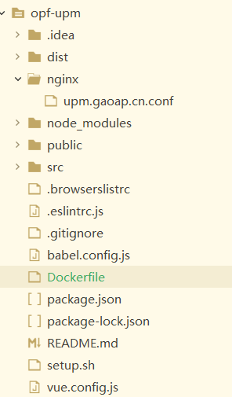
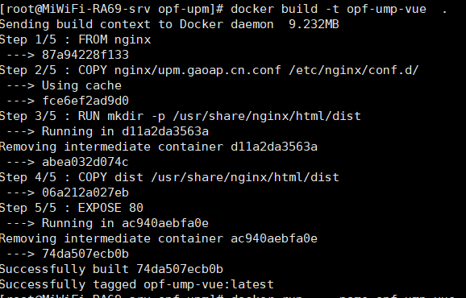

# vue部署

## 非docker部署

1、打包命令

```shell
 npm run build
```

2、将 vue 打包好的 dist 文件丢到 nginx 的html 目录下

3、配置nginx

cd /etc/nginx/conf.d

vim upm.gaoap.cn.conf 添加如下内容 。注意：#upm.gaoap.cn.conf 这个名字自己随便写

```xml
server {
    listen       80;
    listen  [::]:80;
    server_name  upm.gaoap.cn; #host中配置了域名  192.168.31.82 upm.gaoap.cn 

    #access_log  /var/log/nginx/host.access.log  main;

    location / {
        root   /usr/share/nginx/html/dist;
        index  index.html index.htm;
        try_files $uri $uri/ @router; # 需要指向下面的@router否则会出现vue的路由在nginx中刷新出现404
    }
    #对应上面的@router，主要原因是路由的路径资源并不是一个真实的路径，所以无法找到具体的文件
    location @router {
    #因此需要rewrite到index.html中，然后交给路由再处理请求资源
    		rewrite ^.*$ /index.html last;
    }

    # 请求后台服务器，代理设置。所有路径为/upm的请求，转发到http://192.168.31.82:9021
    #
    location ~ /upm {
        proxy_pass   http://192.168.31.82:9021;  #这个是前后端分离的后端服务，自行部署
    }

    # pass the PHP scripts to FastCGI server listening on 127.0.0.1:9000
    #
    #location ~ \.php$ {
    #    root           html;
    #    fastcgi_pass   127.0.0.1:9000;
    #    fastcgi_index  index.php;
    #    fastcgi_param  SCRIPT_FILENAME  /scripts$fastcgi_script_name;
    #    include        fastcgi_params;
    #}

    # deny access to .htaccess files, if Apache's document root
    # concurs with nginx's one
    #
    #location ~ /\.ht {
    #    deny  all;
    #}
}

```

浏览器访问：http://upm.gaoap.cn/ 即可

## docker部署

添加文件：

nginx/upm.gaoap.cn.conf

内容如下：

```xml
server {
    listen       80;
    listen  [::]:80;
    server_name  upm.gaoap.cn;

    #access_log  /var/log/nginx/host.access.log  main;

    location / {
        root   /usr/share/nginx/html/dist;
        index  index.html index.htm;
        try_files $uri $uri/ @router; # 需要指向下面的@router否则会出现vue的路由在nginx中刷新出现404
    }
    #对应上面的@router，主要原因是路由的路径资源并不是一个真实的路径，所以无法找到具体的文件
    location @router {
    #因此需要rewrite到index.html中，然后交给路由再处理请求资源
    		rewrite ^.*$ /index.html last;
    }

    # 请求后台服务器，代理设置。所有路径为/upm的请求，转发到http://192.168.31.82:9021
    #
    location ~ /upm {
        proxy_pass   http://192.168.31.82:9021;
    }

    # pass the PHP scripts to FastCGI server listening on 127.0.0.1:9000
    #
    #location ~ \.php$ {
    #    root           html;
    #    fastcgi_pass   127.0.0.1:9000;
    #    fastcgi_index  index.php;
    #    fastcgi_param  SCRIPT_FILENAME  /scripts$fastcgi_script_name;
    #    include        fastcgi_params;
    #}

    # deny access to .htaccess files, if Apache's document root
    # concurs with nginx's one
    #
    #location ~ /\.ht {
    #    deny  all;
    #}
}

```

添加Dockerfile文件，内容如下：

```dockerfile
##命令的意思该镜像是基于 nginx:latest 镜像而构建的。
FROM nginx
###命令的意思是将 Nginx 目录下的 default.conf 复制到 etc/nginx/conf.d/
COPY nginx/upm.gaoap.cn.conf /etc/nginx/conf.d/
##命令的意思是将项目根目录下 dist 文件夹下的所有文件复制到镜像中 /usr/share/nginx/html/ 目录下。
RUN mkdir -p /usr/share/nginx/html/dist
COPY dist /usr/share/nginx/html/dist

EXPOSE 80

# 构建命令，不要忽略 "."   docker build -t opf-ump-vue  .
```

目录结构：



首先执行：npm run build  命令，生成dist目录。

生成docker image  。不要忽略命令中的"."

执行：docker build -t opf-ump-vue  .   

如图：



启动命令：-p 80:80 代表  -p 本地服务器端口 ：docker容器提供的服务端口

```shell
docker run   --name opf-ump-vue   -d -p 80:80   opf-ump-vue
```

vue服务即启动。可以通过：

```shell
docker exec -it opf-ump-vue  /bin/bash
```

进入docker 容器，查看容器中的nginx情况。

发布到私有仓库：

```
sudo docker login --username=hi31827733@aliyun.com registry.cn-beijing.aliyuncs.com
sudo docker push registry.cn-beijing.aliyuncs.com/gaoap/opf-upm-vue:latest
```

