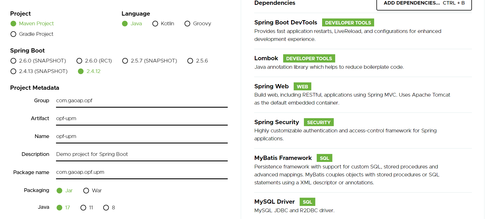
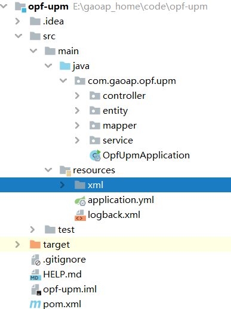

# 一步一步搭建权限管理系统（二）

1、打开[Spring Initializr](https://start.spring.io/)  页面配置springboot基础工程。

例如：



然后点击按钮“ GENERATE”。即生成一个opf-upm.zip文件。里面就是一个配置好springboot的maven功能。直接用IDE工具加载工程即可。

2、将MyBatisPlusGenerator生成的代码，放入工程的相应目录。并将src/main/java/com/gaoap/opf/upm/mapper/xml目录，移动到src/main/resources/xml。如下图：



即完成初始工程。将映射文件移动到resources目录下，可以减少对pom.xml的配置，否则工程不识别映射文件。

3、配置src/main/resources/application.yml文件。完成数据库配置及账号密码的加密处理。

如下：

```yaml
server:
  #程序启动服务的端口号
  port: 9021
spring:  #数据库的配置,springboot默认引入com.zaxxer.hikari.HikariDataSource。不需要额外添加依赖
  datasource:
    type: com.zaxxer.hikari.HikariDataSource
    driver-class-name: com.mysql.cj.jdbc.Driver
    url: jdbc:mysql://localhost:3306/opf-upm?characterEncoding=utf8&useSSL=false&serverTimezone=Asia/Shanghai&allowPublicKeyRetrieval=true
    #ENC()是jasypt的固定用法。（）中存放的是加密后的密文。应用时jasypt会自动解密。
    #需要在@EnableEncryptableProperties 配置在启动入口处，即可。例如类：OpfUpmApplication
    #加密账号，需要引入jasypt依赖.密码解密加密见类：JasyptUtilTest
    username: ENC(EGrfKyd8rlXhuIEP8Pa3og==)
    #加密密码，需要引入jasypt依赖。密码解密加密见类：JasyptUtilTest
    password: ENC(mtrCYNiD56+izjS9u3uSRmrUMu4krb2Q)
jasypt: ##需要引入以来jasypt-spring-boot-starter
  encryptor:
    # 加密盐值
    ## 建议部署的时候 盐 不要放到配置文件，可以用启动参数 -Djasypt.encryptor.password=jasypt 来替代。
    password: jasypt
    # 加密算法设置 3.0.0 以后
    algorithm: PBEWithMD5AndDES
    iv-generator-classname: org.jasypt.iv.NoIvGenerator
mybatis-plus:
  mapper-locations: classpath:**/*Mapper.xml
```

以上代码中的说明已经非常详细。只是需要注意jasypt的使用需要引入依赖：

```xml
        <!--数据库密码加密解密-->
        <dependency>
            <groupId>com.github.ulisesbocchio</groupId>
            <artifactId>jasypt-spring-boot-starter</artifactId>
            <version>3.0.4</version>
        </dependency>
```

需要解密的地方，使用固定用法：ENC(**密文**)即可，在运行时密文被jasypt解密还原。密文的获取，可以执行程序：

src/test/java/com/gaoap/opf/upm/jasypt/JasyptUtilTest.java

```java
public class JasyptUtilTest {
    /**
     * Jasypt生成加密结果
     *
     * @param password 配置文件中设定的加密盐值
     * @param value    加密值
     * @return
     */
    public static String encyptPwd(String password, String value) {
        PooledPBEStringEncryptor encryptor = new PooledPBEStringEncryptor();
        encryptor.setConfig(cryptor(password));
        String result = encryptor.encrypt(value);
        return result;
    }

    /**
     * 解密
     *
     * @param password 配置文件中设定的加密盐值
     * @param value    解密密文
     * @return
     */
    public static String decyptPwd(String password, String value) {
        PooledPBEStringEncryptor encryptor = new PooledPBEStringEncryptor();
        encryptor.setConfig(cryptor(password));
        String result = encryptor.decrypt(value);
        return result;
    }

    public static SimpleStringPBEConfig cryptor(String password) {
        SimpleStringPBEConfig config = new SimpleStringPBEConfig();
        config.setPassword(password);
        //算法
        config.setAlgorithm("PBEWithMD5AndDES");
        //
        config.setKeyObtentionIterations("1000");
        config.setPoolSize("1");
        config.setProviderName("SunJCE");
        config.setSaltGeneratorClassName("org.jasypt.salt.RandomSaltGenerator");
        config.setIvGeneratorClassName("org.jasypt.iv.NoIvGenerator");
        config.setStringOutputType("base64");
        return config;
    }

    @Test
    public  void outPrintln() {
        // 加密
        String encPwd = encyptPwd("jasypt", "upm");
        // 解密
        String decPwd = decyptPwd("jasypt", "sUeIOGRIrkw5S96iqQjDkQ==");
        System.out.println(encPwd);
        System.out.println(decPwd);
    }

}
```

以上数据库配置完成。也完成了数据库账户密码的加密保护。不过在实际生产环境中，建议加密盐不要放在配置文件中，而是在启动程序时指定，例如增加启动参数：  -Djasypt.encryptor.password=jasypt 来替代。

4、增加MyBatis-Plus配置及依赖

引入依赖：

```xml
        <!--MySQL驱动-->
        <dependency>
            <groupId>mysql</groupId>
            <artifactId>mysql-connector-java</artifactId>
            <scope>runtime</scope>
        </dependency>
        <!--mybatis自动装载-->
        <dependency>
            <groupId>org.mybatis.spring.boot</groupId>
            <artifactId>mybatis-spring-boot-starter</artifactId>
            <version>2.2.0</version>
        </dependency>
        <!--mybatis-plus 相关依赖 -->
        <dependency>
            <groupId>com.baomidou</groupId>
            <artifactId>mybatis-plus-boot-starter</artifactId>
            <version>3.4.3.4</version>
        </dependency>
        <dependency>
            <groupId>com.baomidou</groupId>
            <artifactId>mybatis-plus-generator</artifactId>
            <version>3.5.1</version>
        </dependency>
```

新建package:com.gaoap.opf.upm.conf。创建类MybatisPlusConfig.java

```java
/**
 * 指定mapper的路径，如：src/main/java/com/gaoap/opf/upm/mapper
 * mapper类上要增加@Mapper注解，否则可能会出现找不到mapper的情况。
 */
@Configuration
@EnableTransactionManagement
@MapperScan(basePackages = {"com.gaoap.opf.upm.mapper"})//, annotationClass = Mapper.class)
public class MybatisPlusConfig {
    // MybatisPlus分页增强插件
    @Bean
    public MybatisPlusInterceptor mybatisPlusInterceptor() {
        MybatisPlusInterceptor interceptor = new MybatisPlusInterceptor();
        interceptor.addInnerInterceptor(new PaginationInnerInterceptor(DbType.MYSQL));
        return interceptor;
    }
}
```

至此，MyBatis-Plus的基本配置完成。后面就可以开始基本编写业务的CRUD操作了。
