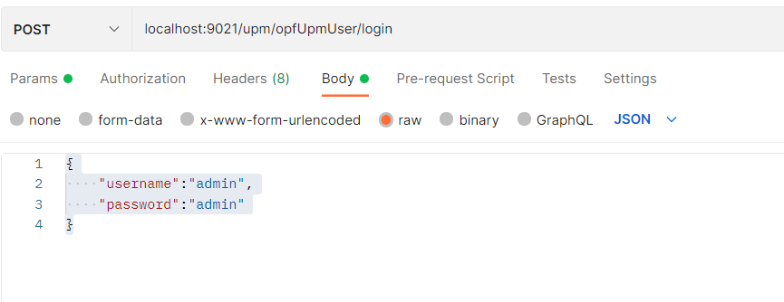
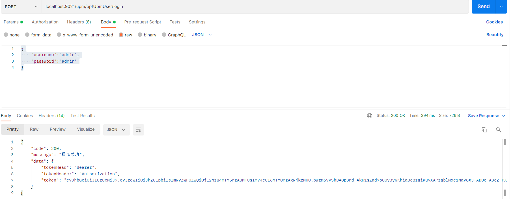

# 一步一步搭建权限管理系统（三）

1、实现一个用户登录的基本接口服务。

编写OpfUpmUserController类，提供http服务接口。代码如下：

```java
//使用@RestController注解，可以省去每个方法体单独使用@ResponseBody。
@RestController
//Swagger定义的接口名称
@Api(tags = "后台用户管理")
//访问此http服务的基础路径
@RequestMapping("/upm/opfUpmUser")
@Slf4j
public class OpfUpmUserController {
    @Value("${opf.upm.jwt.tokenHeader}")
    private String tokenHeader;
    @Value("${opf.upm.jwt.tokenHead}")
    private String tokenHead;
    @Autowired
    private IOpfUpmUserService userService;
    //Swagger定义的接口名称
    @ApiOperation(value = "登录以后返回token")
    //访问此接口服务的完整路径为：http://ip:9021/upm/opfUpmUser/login需要使用post协议
    @PostMapping(value = "/login")
    //@Validated代表参数校验 @RequestBody 代表参数传递使用JSON格式  ，参数约定见类：OpfUpmUserParam
    //参数如果违反约定，会由src/main/java/com/gaoap/opf/upm/common/exception/
    // GlobalExceptionHandler.java 统一处理（这个类涉及Springboot的机制，回头分析用法）
    public CommonResult login(@Validated @RequestBody OpfUpmUserLoginParam umsUserLoginParam) {
        //log使用过注解@Slf4j定义的。主要是利用Lombok插件，简化代码开发
        log.info("准备登录。。。。。。");
        //请求登录实际处理类。如果返回token，则表明登录成功。没有返回token则登录失败
        String token = userService.login(umsUserLoginParam.getUsername(), umsUserLoginParam.getPassword());
        if (token == null) {
            return CommonResult.validateFailed("用户名或密码错误");
        }
        log.info("准备登录。。。。。。{}", token);
        Map<String, String> tokenMap = new HashMap<>();
        //具体的token内容
        tokenMap.put("token", token);
        // token的前缀
        tokenMap.put("tokenHead", tokenHead);
        //headers中储存token的key
        tokenMap.put("tokenHeader", tokenHeader);
        return CommonResult.success(tokenMap);
        /**
         * 登录成功返回的格式为：
         * {
         *     "code": 200,
         *     "message": "操作成功",
         *     "data": {
         *         "tokenHead": "Bearer",
         *         "tokenHeader": "Authorization",
         *         "token": "eyJhbGciOiJIUzUxMiJ9.eyJzdWIiOiJhZG1pbiIs"
         *     }
         * }
         */
    }
```

以上是Controller类举例。基本代码框架在使用代码生成工具“opf-generate”时已经完成。开发时根据业务需要，增加业务代码即可。例如本例中的“登录”方法。

2、编写接口IOpfUpmUserService及实现类OpfUpmUserServiceImpl；

IOpfUpmUserService：

```java
public interface IOpfUpmUserService extends IService<OpfUpmUser> {
    /**
     * 登录功能
     *
     * @param username 用户名
     * @param password 密码
     * @return 生成的JWT的token
     */
    String login(String username, String password);
```

OpfUpmUserServiceImpl:

```java
//@Service声名为IOpfUpmUserService接口实现类，springboot 才会初始化这个类。
@Service
//引入日志log
@Slf4j
public class OpfUpmUserServiceImpl extends ServiceImpl<OpfUpmUserMapper, OpfUpmUser> implements IOpfUpmUserService {
    //JWT生成的辅助类：见com.gaoap.opf.upm.security.jwt.JwtTokenUtil
    @Autowired
    private JwtTokenUtil jwtTokenUtil;
     @Autowired
    private OpfUpmResourceMapper resourceMapper;
    //在代码中src/main/java/com/gaoap/opf/upm/conf/GlobalBeanConfig.java
    //中声名为new BCryptPasswordEncoder()实现。
    @Autowired
    private PasswordEncoder passwordEncoder;
      @Override
    public String login(String username, String password) {
        String token = null;
        try {
             //UserDetails  是SpringSecurity需要的用户详情。这个是SpringSecurity框架的需要
            UserDetails userDetails = loadUserByUsername(username);
            //验证密码是否正确
            if (!passwordEncoder.matches(password, userDetails.getPassword())) {
                Asserts.fail("密码不正确");
            }
            if (!userDetails.isEnabled()) {
                Asserts.fail("帐号已被禁用");
            }
            //生成用户认证凭证，放入Spring Security的上下文中，Spring Security才会认为用户登陆成功
            UsernamePasswordAuthenticationToken authentication = new UsernamePasswordAuthenticationToken(userDetails, null, userDetails.getAuthorities());
            SecurityContextHolder.getContext().setAuthentication(authentication);
            //获取token
            token = jwtTokenUtil.generateToken(userDetails);
        } catch (AuthenticationException e) {
            log.warn("登录异常:", e);
        }
        return token;
    }
    **
     *
     * @param username 用户登录名
     * @return OpfUpmUserDetails是UserDetails的一个自定义实现类，用户承载用户及认证信息
     */
    @Override
    public OpfUpmUserDetails loadUserByUsername(String username) {
        log.info("加载{}：用户信息", username);
        //获取用户信息，OpfUpmUser是对应数据表opf_upm_user的实体类
        //src/main/java/com/gaoap/opf/upm/entity/OpfUpmUser.java
        OpfUpmUser User = getUserByUsername(username);
        if (User != null) {
            //根据用户ID获取，当前用户所拥有的资源权限；
            //每一条 OpfUpmResource对应一个SpringSecurity中的 GrantedAuthority
            //OpfUpmResource是对应数据表opf_upm_resource的实体类
            List<OpfUpmResource> resourceList = getResourceList(User.getId());
            return new OpfUpmUserDetails(User, resourceList);
        }
        throw new UsernameNotFoundException("用户名或密码错误");
    }
     /**
     * 根据用户名获取用户信息，OpfUpmUser是对应数据表opf_upm_user的实体类
     * 参考：src/main/java/com/gaoap/opf/upm/entity/OpfUpmUser.java
     *
     * @param username
     * @return OpfUpmUserDetails是UserDetails的一个自定义实现类，用户承载用户及认证信息
     */
    @Override
    public OpfUpmUser getUserByUsername(String username) {
        //MyBatis-Plus的增强用法，省去手动去配置mapper及*Mapper.xml
        QueryWrapper<OpfUpmUser> wrapper = new QueryWrapper<>();
        wrapper.lambda().eq(OpfUpmUser::getUsername, username);
        //List<T> list(Wrapper<T> queryWrapper) 这个方法，即是IService提供，由MyBatis-Plus自动实现
        //MyBatis-Plus能够自动实现很多此类方法，简化提供CRUD操作的代码量
        List<OpfUpmUser> userList = list(wrapper);
        if (userList != null && userList.size() > 0) {
            return userList.get(0);
        }
        return null;
    }
     /**
     * 根据用户ID获取，当前用户所拥有的资源权限；
     * OpfUpmResource是对应数据表opf_upm_resource的实体类
     *
     * @param UserId
     * @return
     */
    @Override
    public List<OpfUpmResource> getResourceList(Long UserId) {
        List<OpfUpmResource> resourceList;
        //resourceMapper 对应src/main/java/com/gaoap/opf/upm/mapper/OpfUpmResourceMapper.java
        //是表的映射关系类：opf_upm_resource
        //对应的还有一个配套的XML描述文件：src/main/resources/xml/OpfUpmResourceMapper.xml
        //resourceMapper.getResourceList(UserId)是使用映射文件(XML)的实现
        resourceList = resourceMapper.getResourceList(UserId);
        //resourceMapper.getResourceListXML(UserId)是不使用使用映射文件(XML)的实现
        // resourceList = resourceMapper.getResourceListNoXML(UserId);
        return resourceList;
    }
}
    
```

a、使用映射文件(XML)的实现：OpfUpmResourceMapper.xml配置

路径：src/main/resources/xml/OpfUpmResourceMapper.xml

```xml
<?xml version="1.0" encoding="UTF-8"?>
<!DOCTYPE mapper PUBLIC "-//mybatis.org//DTD Mapper 3.0//EN" "http://mybatis.org/dtd/mybatis-3-mapper.dtd">
<mapper namespace="com.gaoap.opf.upm.mapper.OpfUpmResourceMapper">
    <!-- id的标识要和OpfUpmResourceMapper 中的方法名对应-->
    <!-- resultType是表示查询结果返回映射的实体类，这里是OpfUpmResource-->
    <!-- #{userId} 代表要传递的参数，变量名称为：userId -->
    <select id="getResourceList" resultType="com.gaoap.opf.upm.entity.OpfUpmResource">
        SELECT ur.id id,
               ur.create_time,
               ur.name,
               ur.url,
               ur.description,
               ur.category_id
        FROM opf_upm_user_role_relation ar
                 LEFT JOIN opf_upm_role r ON ar.role_id = r.id
                 LEFT JOIN opf_upm_role_resource_relation rrr ON r.id = rrr.role_id
                 LEFT JOIN opf_upm_resource ur ON ur.id = rrr.resource_id
        WHERE ar.user_id = #{userId}
          AND ur.id IS NOT NULL
    </select>
</mapper>
```

 Java：OpfUpmResourceMapper

 路径：src/main/java/com/gaoap/opf/upm/mapper/OpfUpmResourceMapper.java

```java
@Mapper
public interface OpfUpmResourceMapper extends BaseMapper<OpfUpmResource> {
    /**
     * 对应映射文件：OpfUpmResourceMapper.xml
     * 获取用户所有可访问资源，
     *
     * @Param("userId")中的 userId对应xml中的#{userId}
     * 返回对象：List<OpfUpmResource>中的OpfUpmResource对应xml文件中的resultType
     * 方法名：getResourceList对应xml中id
     */
    List<OpfUpmResource> getResourceList(@Param("userId") Long userId);
}
```

b、不使用映射文件(XML)的实现： 直接在OpfUpmResourceMapper编写sql

```java
@Mapper
public interface OpfUpmResourceMapper extends BaseMapper<OpfUpmResource> {
    /** 
     *  ur.* 返回的字段会被映射为OpfUpmResource对象
     *  #{userId}对应方法参数@Param("userId") Long userId
     * @param userId
     * @return
     */
    @Select("  SELECT ur.* \n" +
            "        FROM opf_upm_user_role_relation ar \n" +
            "                 LEFT JOIN opf_upm_role r ON ar.role_id = r.id \n" +
            "                 LEFT JOIN opf_upm_role_resource_relation rrr ON r.id = rrr.role_id \n" +
            "                 LEFT JOIN opf_upm_resource ur ON ur.id = rrr.resource_id \n" +
            "        WHERE ar.user_id = #{userId} \n" +
            "          AND ur.id IS NOT NULL ")
    List<OpfUpmResource> getResourceListNoXML(@Param("userId") Long userId);
}
```

基本登录代码编写完毕，启动程序测试一下：

在IDE中，执行src/main/java/com/gaoap/opf/upm/OpfUpmApplication.java类即可启动。端口号为application.yml文件中的9021。

测试时使用工具Postman测试：

地址：http://localhost:9021/upm/opfUpmUser/login  

协议: POST

参数选择： Body 下的 raw

json:

```xml
{
    "username":"admin",
    "password":"admin"
}
```

如图：




点击“Send”按钮。返回结果如下：



正常请求后，返回图中，下半部分的token。即为登陆成功。

简单登录功能实现完成。谢谢。
