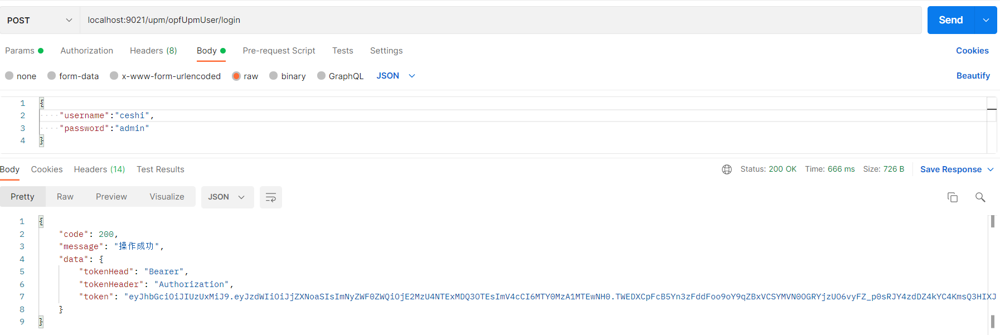
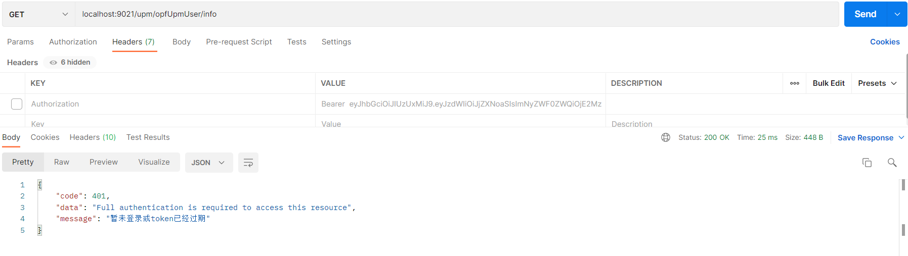
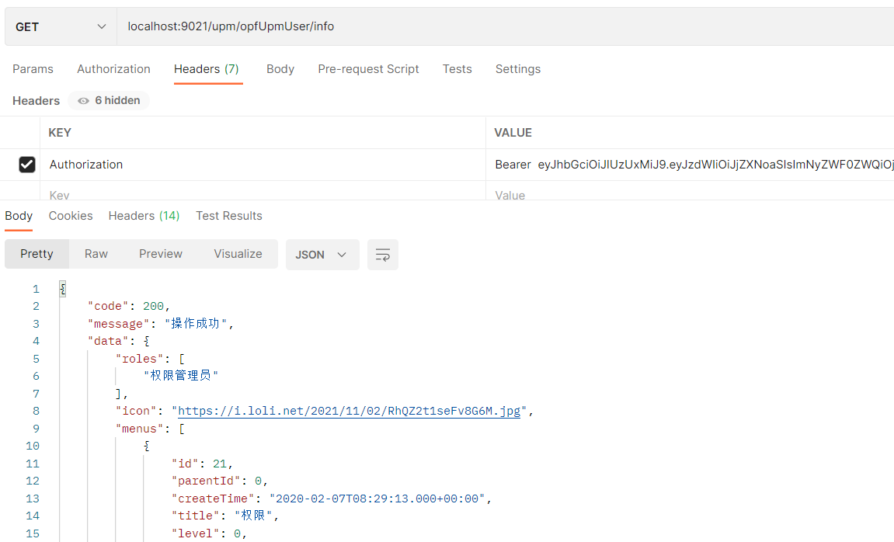

# 一步一步搭建权限管理系统（四）

配置 SpringSecurity。

1、编写SecurityConfig 类，继承WebSecurityConfigurerAdapter

主要三成一下三个配置：

configure(AuthenticationManagerBuilder auth)：用于配置UserDetailsService及PasswordEncoder。

例如：

```java
 /**
     * userDetailsService SpringSecurity定义的核心接口，用于根据用户名获取用户信息（UserDetails）；
     * UserDetails：SpringSecurity定义用于封装用户信息的类（主要是用户信息和权限），需要自行实现；
     * passwordEncoder 用户密码加密算法。例如：BCryptPasswordEncoder
     */
    @Override
    protected void configure(AuthenticationManagerBuilder auth) throws Exception {
        auth.userDetailsService(userDetailsService)
                .passwordEncoder(passwordEncoder);
    }
```


configure(WebSecurity web) 可以配置URL白名单，在这里配置后不会被其它过滤器监控到。

例如：配置swagger，允许免登录访问。

```java
    public void configure(WebSecurity web) throws Exception {

        web.ignoring().
                antMatchers("/**/swagger-ui/**",
                        "/**/swagger-resources/**",
                        "/**/v3/**",
                        "/swagger-resources/**",
                        "/swagger-ui.html",
                        "/v3/**",
                        "/webjars/**");
    }
```

 configure(HttpSecurity httpSecurity)：用于配置需要拦截的url路径、各种过滤器及出异常后的处理器；

```java
 @Override
    protected void configure(HttpSecurity httpSecurity) throws Exception {
        ExpressionUrlAuthorizationConfigurer<HttpSecurity>.ExpressionInterceptUrlRegistry registry = httpSecurity
                .authorizeRequests();
        //允许跨域请求的OPTIONS请求
        registry.antMatchers(HttpMethod.OPTIONS)
                .permitAll();
        // 任何请求需要身份认证
        registry.and()
                .authorizeRequests()
                .anyRequest()
                .authenticated()
                // 关闭跨站请求防护及不使用session
                .and()
                //关闭csrf机制
                .csrf()
                .disable()
                //关闭session
                .sessionManagement()
                .sessionCreationPolicy(SessionCreationPolicy.STATELESS)
                // 自定义权限拒绝处理类
                .and()
                .exceptionHandling()
                //自定义返回结果：没有权限访问时
                .accessDeniedHandler(restfulAccessDeniedHandler)
                //自定义返回结果：未登录或登录过期
                .authenticationEntryPoint(restAuthenticationEntryPoint)
                // 自定义权限拦截器JWT过滤器
                .and()
                //通过JwtAuthenticationTokenFilter检查jwt token是否合法
                .addFilterBefore(new JwtAuthenticationTokenFilter(userDetailsService, jwtTokenUtil, tokenHeader, tokenHead), UsernamePasswordAuthenticationFilter.class);

    }
```

JWT Token检查过滤类：

代码如下：

```java
/**
 * JWT登录授权过滤器;继承自OncePerRequestFilter是Spring Boot里面的一个过滤器抽象类，
 * 这个过滤器抽象类通常被用于继承实现并在每次请求时只执行一次过滤；
 */

@Slf4j
public class JwtAuthenticationTokenFilter extends OncePerRequestFilter {
    //SpringSecurity定义的核心接口，用于根据用户名获取用户信息（UserDetails）
    private UserDetailsService userDetailsService;
    // jwt 生成辅助类
    private JwtTokenUtil jwtTokenUtil;
    //token KEY
    private String tokenHeader;
    //token 前缀
    private String tokenHead;

    public JwtAuthenticationTokenFilter(UserDetailsService userDetailsService, JwtTokenUtil jwtTokenUtil, String tokenHeader, String tokenHead) {
        this.userDetailsService = userDetailsService;
        this.jwtTokenUtil = jwtTokenUtil;
        this.tokenHeader = tokenHeader;
        this.tokenHead = tokenHead;

    }

    @Override
    protected void doFilterInternal(HttpServletRequest request,
                                    HttpServletResponse response,
                                    FilterChain chain) throws ServletException, IOException {
        log.info("进入JwtAuthenticationTokenFilter:{}", request.getPathInfo());
        String authHeader = request.getHeader(this.tokenHeader);
        if (authHeader != null && authHeader.startsWith(this.tokenHead)) {
            // Bearer代表Authorization头定义的schema ，除了Bearer，还有其它的一些 schemas  ,
            //  参考：https://developer.mozilla.org/en-US/docs/Web/HTTP/Authentication#authentication_schemes
            String authToken = authHeader.substring(this.tokenHead.length());
            String username = jwtTokenUtil.getUserNameFromToken(authToken);
            log.info("checking username:{}", username);
            if (username != null && SecurityContextHolder.getContext().getAuthentication() == null) {
                UserDetails userDetails = this.userDetailsService.loadUserByUsername(username);
                if (jwtTokenUtil.validateToken(authToken, userDetails.getUsername())) {
                    UsernamePasswordAuthenticationToken authentication = new UsernamePasswordAuthenticationToken(userDetails, null, userDetails.getAuthorities());
                    authentication.setDetails(new WebAuthenticationDetailsSource().buildDetails(request));
                    log.info("authenticated user:{}", username);
                    SecurityContextHolder.getContext().setAuthentication(authentication);
                }
            }
        }
        chain.doFilter(request, response);
    }
}
```

未登录或登录过期提示实现类：

```java
/**
 * 自定义返回结果：未登录或登录过期
 */
@Component
@Slf4j
public class RestAuthenticationEntryPoint implements AuthenticationEntryPoint {
    @Override
    public void commence(HttpServletRequest request, HttpServletResponse response, AuthenticationException authException) throws IOException, ServletException {
        response.setHeader("Access-Control-Allow-Origin", "*");
        response.setHeader("Cache-Control", "no-cache");
        response.setCharacterEncoding("UTF-8");
        response.setContentType("application/json");
        response.getWriter().println(JSONUtil.parse(CommonResult.unauthorized(authException.getMessage())));
        response.getWriter().flush();
    }
}
```

没有访问权限提示,实现类：

```java
/**
 * 自定义返回结果：没有权限访问时
 */
@Component
@Slf4j
public class RestfulAccessDeniedHandler implements AccessDeniedHandler {
    @Override
    public void handle(HttpServletRequest request,
                       HttpServletResponse response,
                       AccessDeniedException e) throws IOException, ServletException {
        response.setHeader("Access-Control-Allow-Origin", "*");
        response.setHeader("Cache-Control", "no-cache");
        response.setCharacterEncoding("UTF-8");
        response.setContentType("application/json");
        response.getWriter().println(JSONUtil.parse(CommonResult.forbidden(e.getMessage())));
        response.getWriter().flush();
    }
}
```

2、编写GlobalCorsConfig类，配置全局跨域配置

```java
@Configuration
public class GlobalCorsConfig {

    /**
     * 允许跨域调用的过滤器
     */
    @Bean
    public CorsFilter corsFilter() {
        CorsConfiguration config = new CorsConfiguration();
        //允许所有域名进行跨域调用，
        // config.addAllowedOrigin("*");
        // springboot 2.4.0版本开始，使用addAllowedOrigin会提示错误异常。官方建议使用addAllowedOriginPattern
        config.addAllowedOriginPattern("*");
        //允许跨越发送cookie
        config.setAllowCredentials(true);
        //放行全部原始头信息
        config.addAllowedHeader("*");
        //允许所有请求方法跨域调用
        config.addAllowedMethod("*");
        UrlBasedCorsConfigurationSource source = new UrlBasedCorsConfigurationSource();
        source.registerCorsConfiguration("/**", config);
        return new CorsFilter(source);
    }
}
```

3、配置完成以后，启动服务。使用test/admin账号获取token;地址：http://localhost:9021/upm/opfUpmUser/login

如截图：



3、使用token获取用户信息。

首先不使用token查询：http://localhost:9021/upm/opfUpmUser/info  

如截图：



提示"暂未登录或token已经过期"；

使用token查询：



以上SpringSecurity配置完毕。