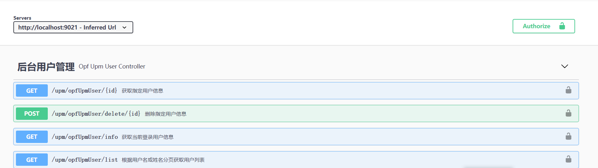
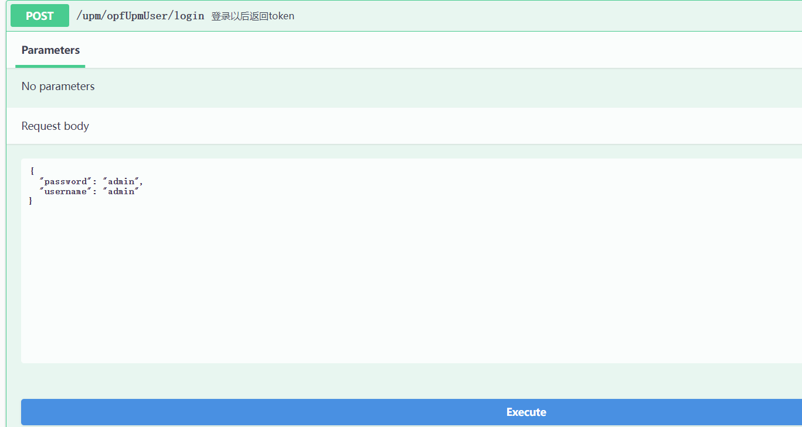
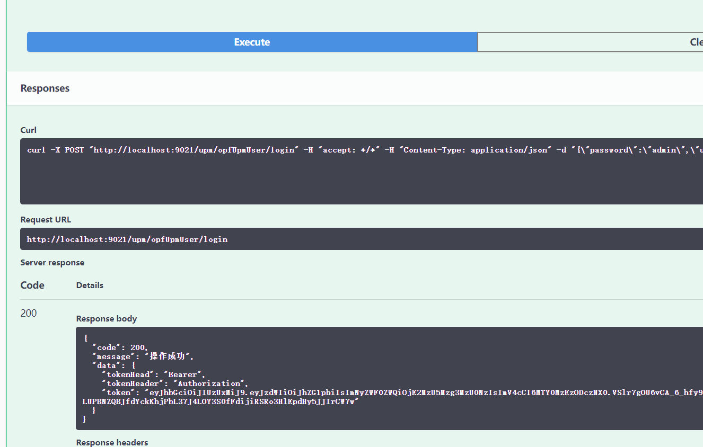
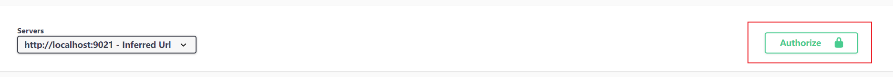
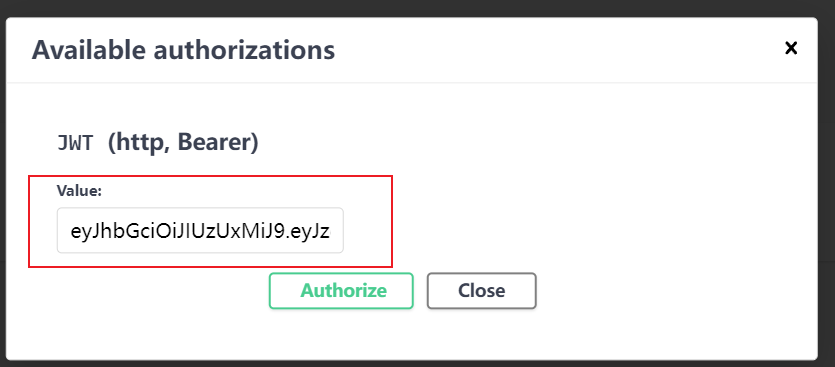
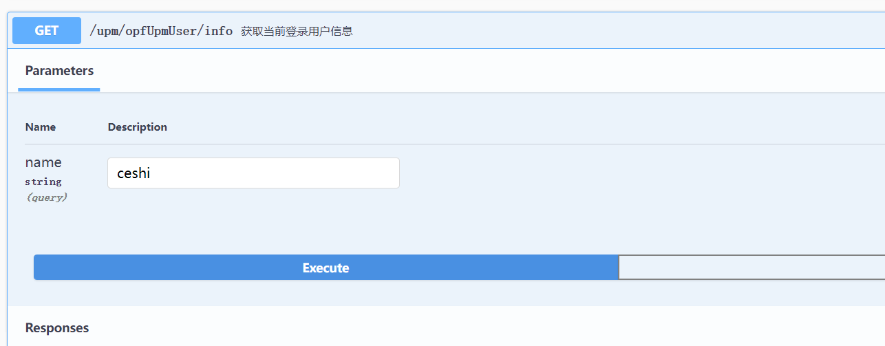
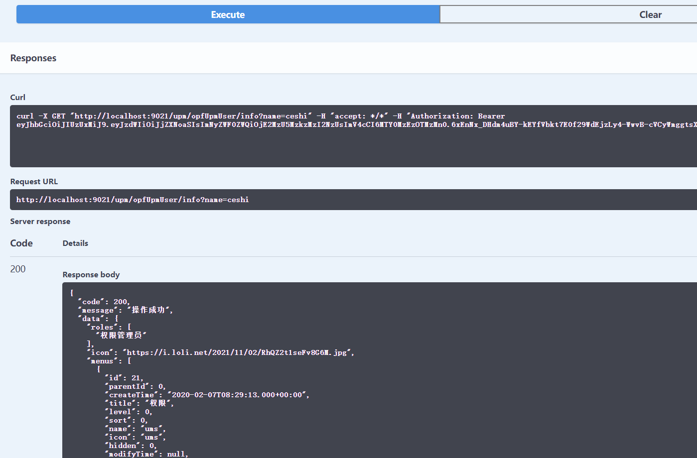

# 一步一步搭建权限管理系统（五）

配置接口文档：Swagger3

1、pom.xml添加依赖

```xml
<!-- Swagger依赖-->
        <dependency>
            <groupId>io.springfox</groupId>
            <artifactId>springfox-boot-starter</artifactId>
            <version>3.0.0</version>
        </dependency>
```

2、编写配置类Swagger3Config.java

```java
/**
 * 访问地址：http://localhost:9021/swagger-ui/index.html
 */
@Configuration
@EnableOpenApi
public class Swagger3Config {
    @Bean
    public Docket createRestApi() {
        return new Docket(DocumentationType.OAS_30)
                .apiInfo(apiInfo())
                .securitySchemes(Collections.singletonList(HttpAuthenticationScheme.JWT_BEARER_BUILDER
//                        显示用
                        .name("JWT")
                        .build()))
                .securityContexts(Collections.singletonList(SecurityContext.builder()
                        .securityReferences(Collections.singletonList(SecurityReference.builder()
                                .scopes(new AuthorizationScope[0])
                                .reference("JWT")
                                .build()))
                        // 声明作用域
                        .operationSelector(o -> o.requestMappingPattern().matches("/.*"))
                        .build()))
                .select()
                .apis(RequestHandlerSelectors.withMethodAnnotation(ApiOperation.class))
                // .apis(RequestHandlerSelectors.basePackage("com.gaoap.opf.upm.controller"))
                .paths(PathSelectors.any())
                .build();
    }

    private ApiInfo apiInfo() {
        return new ApiInfoBuilder()
                .title("Swagger3接口文档")
                .description("更多请咨询服务开发者")
                .contact(new Contact("gaoyd", "http://www.gaoap.cn", "gaoyd@gaoap.com"))
                .version("1.0.0")
                .build();
    }
}
/**
 * @Api：用在请求的类上，表示对类的说明 tags="说明该类的作用，可以在UI界面上看到的注解"
 * value="该参数没什么意义，在UI界面上也看到，所以不需要配置"
 * @ApiOperation：用在请求的方法上，说明方法的用途、作用 value="说明方法的用途、作用"
 * notes="方法的备注说明"
 * @ApiImplicitParams：用在请求的方法上，表示一组参数说明
 * @ApiImplicitParam：用在@ApiImplicitParams注解中，指定一个请求参数的各个方面 name：参数名
 * value：参数的汉字说明、解释
 * required：参数是否必须传
 * paramType：参数放在哪个地方
 * · header --> 请求参数的获取：@RequestHeader
 * · query --> 请求参数的获取：@RequestParam
 * · path（用于restful接口）--> 请求参数的获取：@PathVariable
 * · div（不常用）
 * · form（不常用）
 * dataType：参数类型，默认String，其它值dataType="Integer"
 * defaultValue：参数的默认值
 * @ApiResponses：用在请求的方法上，表示一组响应
 * @ApiResponse：用在@ApiResponses中，一般用于表达一个错误的响应信息 code：数字，例如400
 * message：信息，例如"请求参数没填好"
 * response：抛出异常的类
 * @ApiModel：用于响应类上，表示一个返回响应数据的信息 （这种一般用在post创建的时候，使用@RequestBody这样的场景，
 * 请求参数无法使用@ApiImplicitParam注解进行描述的时候）
 * @ApiModelProperty：用在属性上，描述响应类的属性
 */
```

3、配置Swagger白名单：SecurityConfig.java

```java
 private static final String[] AUTH_WHITELIST = {

            // -- swagger ui
            "/**/swagger-ui/**",
            "/**/swagger-resources/**",
            "/**/v3/**",
            "/swagger-resources/**",
            "/swagger-ui.html",
            "/v3/**",
            "/webjars/**"
    };
    @Override
    public void configure(WebSecurity web) throws Exception {

        web.ignoring().
                antMatchers(AUTH_WHITELIST);
    }
```

4、配置接口说明，例如：OpfUpmUserController.java

```java
//使用@RestController注解，可以省去每个方法体单独使用@ResponseBody。
@RestController
//Swagger定义的接口名称
@Api(tags = "后台用户管理")
//访问此http服务的基础路径
@RequestMapping("/upm/opfUpmUser")
@Slf4j
public class OpfUpmUserController {
    @Value("${opf.upm.jwt.tokenHeader}")
    private String tokenHeader;
    @Value("${opf.upm.jwt.tokenHead}")
    private String tokenHead;
    @Autowired
    private IOpfUpmUserService userService;
    @Autowired
    private IOpfUpmRoleService roleService;

    @ApiOperation(value = "用户注册" )
    @PostMapping(value = "/register")
    public CommonResult<OpfUpmUser> register(@Validated @RequestBody OpfUpmUserParam umsUserParam) {
        OpfUpmUser umsUser = userService.register(umsUserParam);
        if (umsUser == null) {
            return CommonResult.failed();
        }
        return CommonResult.success(umsUser);
    }

    //Swagger定义的接口名称
    @ApiOperation(value = "登录以后返回token")
    //访问此接口服务的完整路径为：http://ip:9021/upm/opfUpmUser/login需要使用post协议
    @PostMapping(value = "/login")
    //@Validated代表参数校验 @RequestBody 代表参数传递使用JSON格式  ，参数约定见类：OpfUpmUserParam
    //参数如果违反约定，会由src/main/java/com/gaoap/opf/upm/common/exception/
    // GlobalExceptionHandler.java 统一处理（这个类涉及Springboot的机制，回头分析用法）
    public CommonResult login(@Validated @RequestBody OpfUpmUserLoginParam umsUserLoginParam) {
        //log使用过注解@Slf4j定义的。主要是利用Lombok插件，简化代码开发
        log.info("准备登录。。。。。。");
        //请求登录实际处理类。如果返回token，则表明登录成功。没有返回token则登录失败
        String token = userService.login(umsUserLoginParam.getUsername(), umsUserLoginParam.getPassword());
        if (token == null) {
            return CommonResult.validateFailed("用户名或密码错误");
        }
        log.info("准备登录。。。。。。{}", token);
        Map<String, String> tokenMap = new HashMap<>();
        //具体的token内容
        tokenMap.put("token", token);
        // token的前缀
        tokenMap.put("tokenHead", tokenHead);
        //headers中储存token的key
        tokenMap.put("tokenHeader", tokenHeader);
        return CommonResult.success(tokenMap);
    }


    @ApiOperation(value = "刷新token")
    @GetMapping(value = "/refreshToken")
    public CommonResult refreshToken(HttpServletRequest request) {
        String token = request.getHeader(tokenHeader);
        String refreshToken = userService.refreshToken(token);
        if (refreshToken == null) {
            return CommonResult.failed("token已经过期！");
        }
        Map<String, String> tokenMap = new HashMap<>();
        //具体的token内容
        tokenMap.put("token", token);
        // token的前缀
        tokenMap.put("tokenHead", tokenHead);
        //headers中储存token的key
        tokenMap.put("tokenHeader", tokenHeader);
        return CommonResult.success(tokenMap);
    }
}
```

5、启动服务，访问地址：http://localhost:9021/swagger-ui/index.html  即可看到接口文档。

如图：



6、模拟登录

步骤1：



步骤二：点击“Execute”按钮。请求返回token



获取到用户token :,点击界面右上角的“Authorize”按钮。

在弹出的窗口中，添加toekn字符串后点击“Authorize“按钮。完成token添加。



测试接口：[
​/upm​/opfUpmUser​/info](http://localhost:9021/swagger-ui/index.html#/后台用户管理/getUserInfoUsingGET)

获取当前登录用户信息



点击“Execute”返回查询结果：



说明权限验证通过，返回用户信息。

以上是Swagger3接口的使用。谢谢。

另外还有2个Swagger的增强工具，knife4j和YApi有兴趣的同学，可以自己尝试一下。尤其推荐YApi。